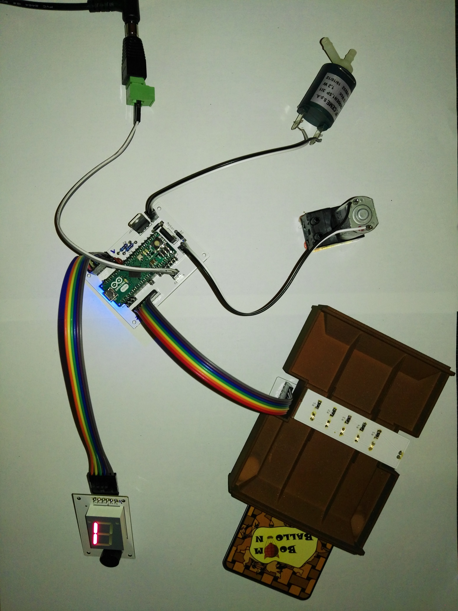

<p align="center">
  
</p>

# Boom Balloon



*The unit pictured is the earlier Arduino Micro prototype (the "prototype 2" generation); the current firmware targets the Arduino Nano (ATmega328P) — see [the story](docs/story.md#the-controller-from-micro-to-nano).*

**An electronic party game where players inflate a real balloon with punched cards until it bursts — whoever is holding the moment it pops loses.**

Players insert optically-coded punched cards into a reader; the firmware decodes each card and drives a 12 V pump (or a valve) to inflate or deflate a real balloon. A software model tracks the balloon's fill level as a simulated "volume" percentage. Cross 100 % on your turn and the balloon pops — you lose. The whole thing runs on an Arduino Nano (ATmega328P).

**Docs site:** https://boomballoon.github.io/

## In 30 seconds

- **Insert a coded card.** Each card is punched with a 5-bit optical pattern that the reader scans as it slides in.
- **The firmware acts.** It decodes the card and drives a 12 V pump to inflate the balloon — or opens a valve to let air back out.
- **The volume climbs.** A software model tracks the balloon's fill level as a percentage, ticking toward 100 % with every risky card.
- **Burst = you lose.** Cross 100 % on your turn and the balloon pops. Last player standing wins.

## Repo structure

- **`firmware/`** — Arduino/C++ firmware for the Arduino Nano (ATmega328P) control board.
- **`hardware/`** — PCB Fritzing files, PCB images, component datasheets, bill of materials, and enclosure CAD.
- **`cards/`** — card artwork and deck/code pointers.
- **`docs/`** — source for the MkDocs Material documentation site.
- **`media/`** — prototype photos.

## Build the docs locally

```bash
pip install -r docs/requirements.txt
mkdocs serve -f docs/mkdocs.yml
```

The site is built with [MkDocs Material](https://squidfunk.github.io/mkdocs-material/).

## Common tasks

A root `Makefile` wraps the everyday commands — run `make` to see them all:

| Command | What it does |
|---|---|
| `make build` | Build the firmware for the Arduino Nano |
| `make upload` | Build + flash the Nano (`PORT=…` to force the serial port) |
| `make mock` | Flash the no-hardware serial mock build (drive the game over serial) |
| `make monitor` | Open the serial console |
| `make docs` | Build the documentation site (`make docs-serve` to live-preview) |

Firmware targets need [PlatformIO](https://platformio.org/) (`pio`) on your
`PATH`; docs targets use a local virtualenv created by `make docs-setup`.

## Key pages

- [Build Guide — Overview & BOM](docs/build-guide/overview-bom.md)
- [The Card Deck](docs/gameplay/card-deck.md)

## Publishing

Docs are built and deployed to GitHub Pages automatically by [`.github/workflows/deploy-docs.yml`](.github/workflows/deploy-docs.yml) on every push to `main`, publishing at [https://boomballoon.github.io/](https://boomballoon.github.io/).

## License

© 2016–2026 Christian Volkmar and Dirk Wilden. Licensed under [CC BY-NC-SA 4.0](https://creativecommons.org/licenses/by-nc-sa/4.0/) — share and adapt for non-commercial use, with attribution, under the same terms. Commercial use requires permission (contact dirkwilden@gmail.com). See [LICENSE](LICENSE).
