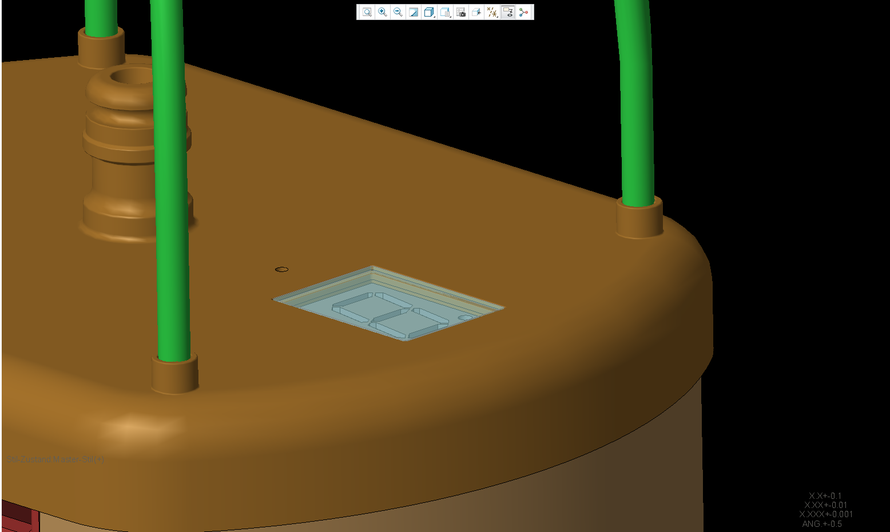
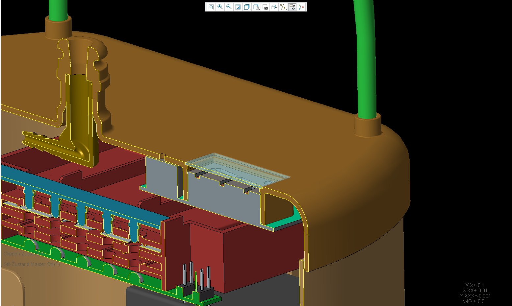
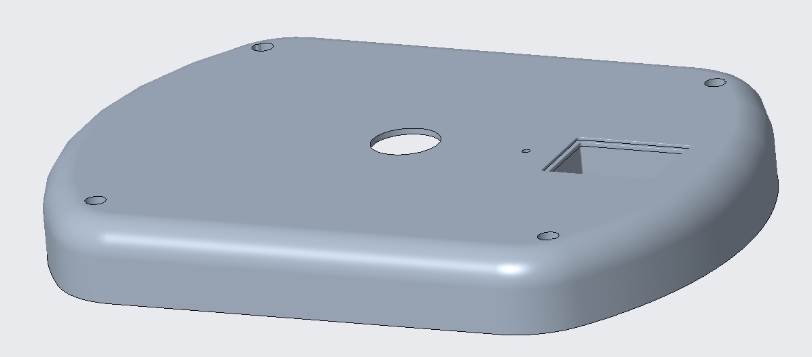
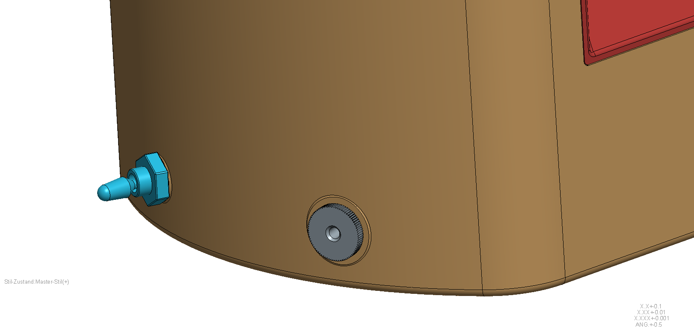

# Enclosure

The enclosure (*Gehäuse*, housing) is the 3D-printed body that holds everything
together: the balloon and its nozzle, the display window, the card slot, and the
pump/valve mounts. It is the most visually distinctive — and by far the most
expensive — part of the project.

<figure markdown>
  { width="420" }
  <figcaption>Full device — rendered assembly</figcaption>
</figure>

## Parts

The housing splits into several printed parts plus one cut window:

| Part | German name | Role | CAD file (base name) |
|---|---|---|---|
| Upper housing | *Gehäuse Oberteil* | upper body shell | `180820_bb_got` |
| Lower housing | *Gehäuse Unterteil* | lower body shell / base | `180123_bb_gut` |
| Roof / spire | *Dach-Spitz* | top cap | `180123_bb_dach` |
| Hose nozzle | *Schlauch-Stutzen* | balloon nozzle mount (upper) | `180123_bb_got_stutzen` |
| Card-module housing | *Kartenmodul-Gehäuse* | shroud for the card slot | `180123_bb_karten-modul_gehaeuse` |
| Full assembly | *Device komplett* | reference assembly of all parts | `180129_bb_device_cpl_asm` |
| Display window | *Scheibe* | polycarbonate pane (Reely, cut to size) | — (not printed) |

The pump and valve mount inside the lower housing; the display window is a
polycarbonate pane (Reely, from Conrad) fitted over the 7-segment display.

<figure markdown>
  { width="360" }
  <figcaption>Assembly — alternate view</figcaption>
</figure>

<figure markdown>
  { width="360" }
  <figcaption>Upper housing (Gehäuse Oberteil)</figcaption>
</figure>

<figure markdown>
  { width="360" }
  <figcaption>Assembly detail</figcaption>
</figure>

## CAD files

Neutral-format CAD exports are committed to the repository, so you don't need
the original Creo/Pro-E files to print or machine the parts:

- **STEP** (`.stp`, for CAD/CAM):
  [`hardware/enclosure/step/`](https://github.com/d-rk/boomballon/tree/main/hardware/enclosure/step)
- **STL** (`.stl`, for slicing/printing):
  [`hardware/enclosure/stl/`](https://github.com/d-rk/boomballon/tree/main/hardware/enclosure/stl)
- **Render PNGs**:
  [`hardware/enclosure/`](https://github.com/d-rk/boomballon/tree/main/hardware/enclosure)

Individual STL parts:
[dach](https://github.com/d-rk/boomballon/blob/main/hardware/enclosure/stl/180123_bb_dach.stl) ·
[got (upper)](https://github.com/d-rk/boomballon/blob/main/hardware/enclosure/stl/180820_bb_got.stl) ·
[gut (lower)](https://github.com/d-rk/boomballon/blob/main/hardware/enclosure/stl/180123_bb_gut.stl) ·
[got_stutzen (nozzle)](https://github.com/d-rk/boomballon/blob/main/hardware/enclosure/stl/180123_bb_got_stutzen.stl) ·
[karten-modul_gehaeuse](https://github.com/d-rk/boomballon/blob/main/hardware/enclosure/stl/180123_bb_karten-modul_gehaeuse.stl)

## Print / quote history — cost-blocked

The enclosure is where the prototype budget went. The parts were quoted by two
professional 3D-printing services, both of which came back too expensive to
justify a polished production housing:

- **i.materialise** — polished-finish quotes ran roughly €100–135 for the upper
  and lower housing shells *each*, plus the card module, roof, and nozzle.
- **Rapid Object** — comparable or higher quotes; the order sheet flags these
  rows outright as *ZU TEUER* (too expensive).

Together with the electronics, these quotes drove the **~€577** aggregate
prototype spend (see the [BOM](overview-bom.md#cost)). A future rebuild would
most likely print the housing in-house (FDM/SLA) from the committed STL files
rather than order polished prints.
