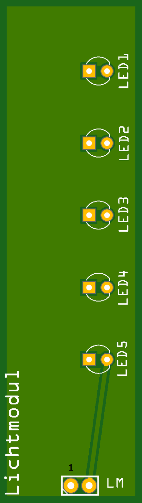
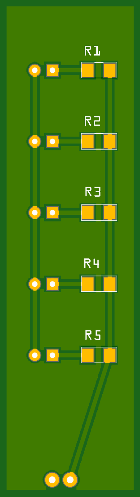
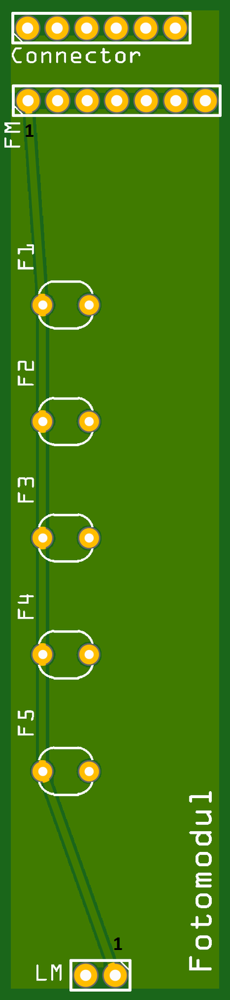
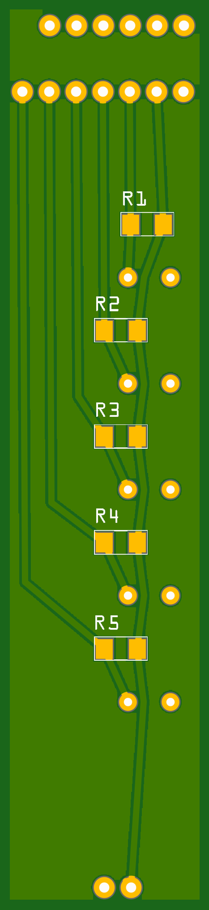

# Card Reader

The card reader (*Kartenmodul*, card module) is how the device knows which card
a player has inserted. It is an **optical** reader: it never touches a contact
or a chip. Instead it shines light through the card and measures where the light
gets through.

It is built from two stacked PCBs:

- the **Lichtmodul** (light module) — the illuminator, and
- the **Fotomodul** (photo module) — the sensor.

A card slides into the gap between them. Each card carries a pattern of clear
and opaque spots; the sensors below read that pattern as a 5-bit value. The
encoding itself is documented separately in the
[Optical Code System](../../reference/optical-codes.md) reference.

## Lichtmodul (light module)

The *Lichtmodul* is the light source. It carries **5× 3 mm LEDs**, each with its
own **330 Ω** series resistor to limit current. The five LEDs sit directly above
the five sensors on the *Fotomodul*, so each sensor is lit from above through
the card.

<figure markdown>
  { width="360" }
  <figcaption>Lichtmodul PCB — top</figcaption>
</figure>

<figure markdown>
  { width="360" }
  <figcaption>Lichtmodul PCB — bottom</figcaption>
</figure>

Fritzing source:
[`Kartenleser_Lichtmodul.fzz`](https://github.com/d-rk/boomballon/blob/main/hardware/card-reader/Kartenleser_Lichtmodul.fzz).

## Fotomodul (photo module)

The *Fotomodul* is the sensor board. It carries **5× photoresistors**
(light-dependent resistors, Reichelt A 905014), each forming a
**voltage divider** with a **10 kΩ** resistor. Each divider's midpoint feeds one
of the Arduino's analog inputs, `A0`–`A4`. A lit sensor (light passing through a
clear spot on the card) and an unlit sensor (light blocked by an opaque spot)
produce clearly different analog voltages, which the firmware thresholds into
the 5 bits of the card code.

!!! warning "Divider resistor is 10 kΩ, not 330 Ω"
    The Fritzing sketch shows **330 Ω** on the Fotomodul dividers, but that is a
    drawing error. The correct — and actually ordered — value is **10 kΩ**
    (Bürklin 28 E497). 330 Ω is far too small for a photocell divider and would
    give almost no usable voltage swing. **Build with 10 kΩ.**

<figure markdown>
  { width="360" }
  <figcaption>Fotomodul PCB — top</figcaption>
</figure>

<figure markdown>
  { width="360" }
  <figcaption>Fotomodul PCB — bottom</figcaption>
</figure>

Fritzing source:
[`Kartenleser_Fotomodul.fzz`](https://github.com/d-rk/boomballon/blob/main/hardware/card-reader/Kartenleser_Fotomodul.fzz).

### Fotomodul connector (7-pin)

The *Fotomodul* connects to the [control board](control-board.md) through a
7-pin header. Note the module runs at **3.3 V**, not 5 V, for a stable analog
reference:

| Pin | Signal | Notes |
|---|---|---|
| 1 | Vcc | **3.3 V** |
| 2 | GND | |
| 3 | A0 | card bit 0 |
| 4 | A1 | card bit 1 |
| 5 | A2 | card bit 2 |
| 6 | A3 | card bit 3 |
| 7 | A4 | card bit 4 |

The `A0`–`A4` lines land on the Arduino's analog inputs. For the complete signal
map across all modules, see the [wiring & pin map](../wiring-pinmap.md).

## Calibration

Because photocell behaviour depends on the exact LEDs, ambient light, and card
material, the firmware ships with a bring-up harness that prints raw analog
values so you can pick thresholds. See
[`MODE_CODE_DETECTOR_CALIBRATION`](../firmware-build.md#build-switches) on the
firmware build page.
