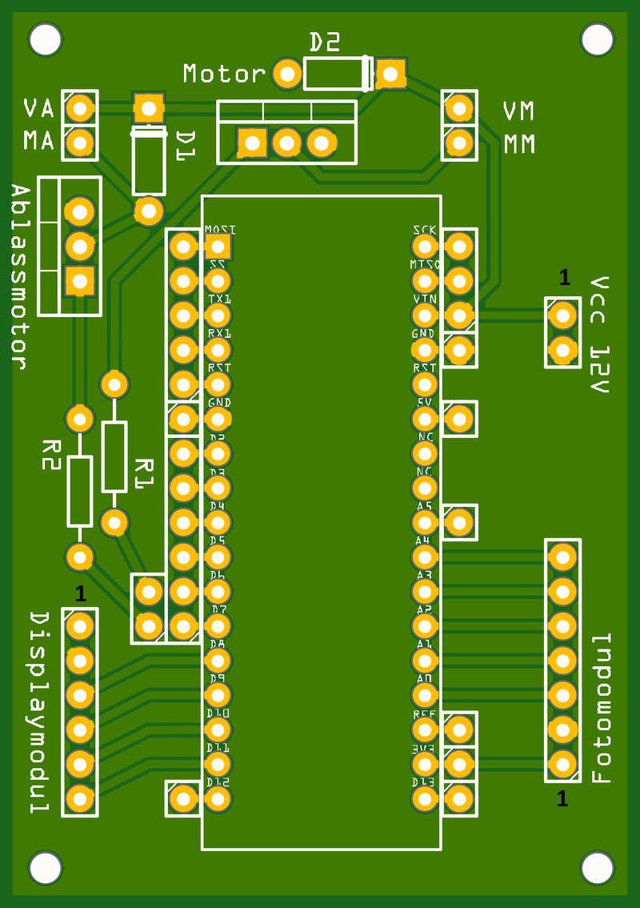
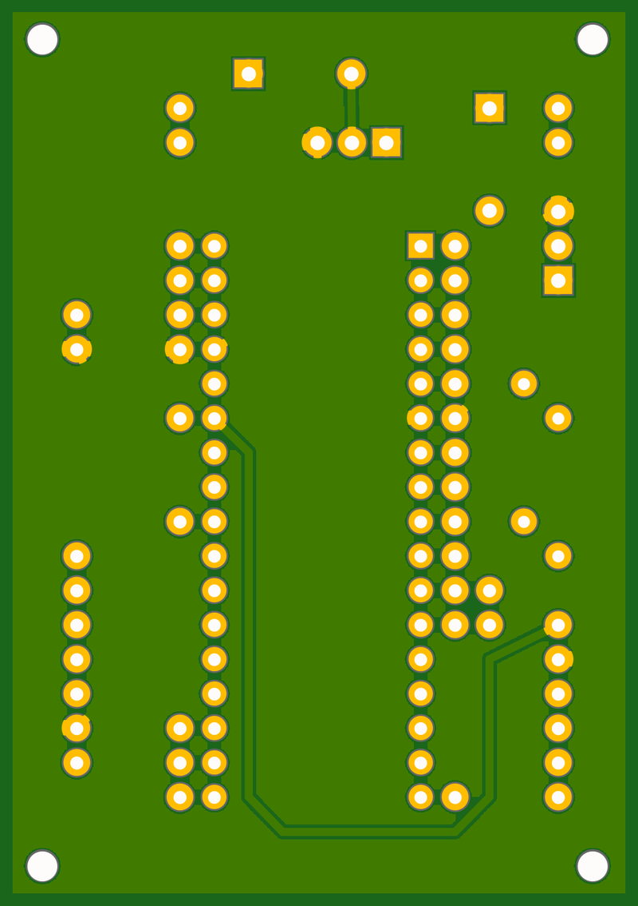

# Control Board

The control board (*Steuermodul*, control module) is the **hub** of the device.
The Arduino Nano sits on it, the 12 V power comes in here, and the other two
modules — the [card reader](card-reader.md) and the [display](display.md) — plug
into it. It also carries the power electronics that switch the two 12 V loads:
the inflate pump and the deflate valve.

<figure markdown>
  { width="420" }
  <figcaption>Steuermodul PCB — top (Arduino and connectors)</figcaption>
</figure>

<figure markdown>
  { width="420" }
  <figcaption>Steuermodul PCB — bottom</figcaption>
</figure>

## Power switching: two TIP120 channels

The Arduino cannot drive a 12 V pump or solenoid directly, so each load has a
**TIP120 Darlington transistor** acting as a low-side switch. There are two
identical channels:

- **Pump channel** — output terminals **MA/MM** (*Motor*), drives the AIRPO
  D2028B membrane pump (inflate). Controlled by MCU pin **D6**.
- **Valve channel** — output terminals **VA/VM** (*Ventil*, valve), drives the
  CEME 5000EN1,5P solenoid valve (deflate). Controlled by MCU pin **D7**.

Each channel is the textbook TIP120 low-side driver:

- a **2.2 kΩ base resistor** between the MCU pin and the transistor base,
- the load (pump or valve coil) between +12 V and the transistor collector,
- the emitter to ground, and
- a **1N4004 flyback diode** across the coil (cathode to +12 V) to clamp the
  inductive kick when the transistor turns off.

The design basis is the well-known **bildr TIP120 tutorial**, archived here as
[`Motorsteuerung.pdf`](https://github.com/d-rk/boomballon/blob/main/hardware/control/Motorsteuerung.pdf)
(*Motorsteuerung* = motor control).

!!! danger "Don't omit the flyback diodes"
    Both the pump and the valve are inductive. Without the **1N4004** clamp
    diode across each coil, turning the transistor off produces a large voltage
    spike that will eventually destroy the TIP120. One diode per channel,
    oriented cathode toward +12 V.

## Connectors

Everything meets on this board:

| Connector | To module | Pins |
|---|---|---|
| Fotomodul header | [Card reader](card-reader.md) | 7-pin (3.3 V, `A0`–`A4`) |
| Displaymodul header | [Display](display.md) | 6-pin (5 V, `DS`/`STCP`/`SHCP`/buzzer) |
| Power input | 12 V / 3 A supply | via switched DC socket |
| Pump output (MA/MM) | AIRPO pump | 12 V, switched by D6 |
| Valve output (VA/VM) | CEME valve | 12 V, switched by D7 |

Fritzing source:
[`Steuermodul.fzz`](https://github.com/d-rk/boomballon/blob/main/hardware/control/Steuermodul.fzz).

For the complete, authoritative signal map — including which analog and digital
pins each connector carries — see the [wiring & pin map](../wiring-pinmap.md).
