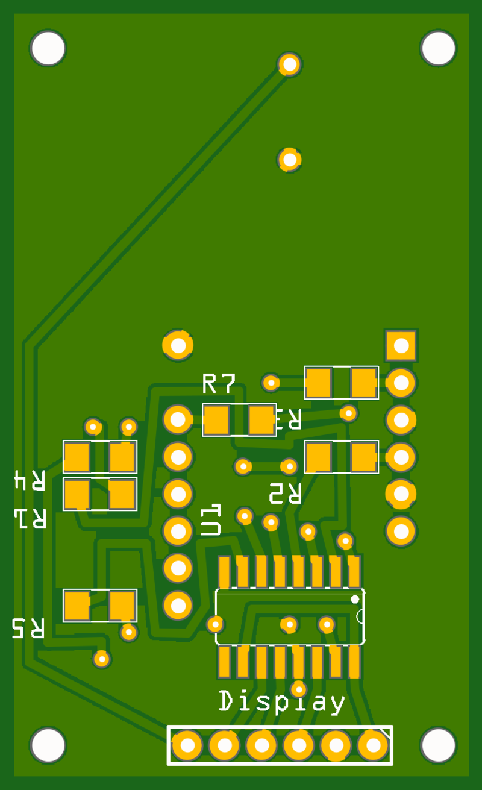

# Display

The display (*Displaymodul*) is the device's only visual output: a single
**20 mm 7-segment digit** that shows the current player number, countdowns, and
game state. It also carries the **piezo buzzer** for game sounds. Both are
driven from just four Arduino pins, because the segments go through a shift
register.

## Circuit

A single **74HC595** shift register (SMD) drives the display. The Arduino clocks
8 bits into the register serially; the register's eight outputs drive the seven
segments plus the decimal point, each through its own **330 Ω** current-limiting
resistor (**8× 330 Ω** total). This trades three fast MCU pins for eight segment
lines.

The 7-segment digit is **common cathode** (part SC08-11). The buzzer (EKULIT
AL-60P12) is driven directly from a dedicated MCU pin.

<figure markdown>
  { width="360" }
  <figcaption>Displaymodul PCB — top</figcaption>
</figure>

<figure markdown>
  { width="360" }
  <figcaption>Displaymodul PCB — bottom</figcaption>
</figure>

Fritzing source:
[`Displaymodul.fzz`](https://github.com/d-rk/boomballon/blob/main/hardware/display/Displaymodul.fzz).

## Connector (6-pin)

The module connects to the [control board](control-board.md) through a 6-pin
header. The three shift-register control lines and the buzzer map to Arduino
digital pins as shown. The module runs at **5 V**:

| Pin | Signal | 74HC595 role | MCU pin |
|---|---|---|---|
| 1 | Vcc | +5 V | — |
| 2 | GND | | — |
| 3 | DS | serial **data** in | **D8** |
| 4 | STCP | storage-register clock (**latch**) | **D9** |
| 5 | SHCP | shift-register **clock** | **D10** |
| 6 | Buzzer | piezo buzzer drive | **D11** |

To update the digit, the firmware shifts 8 bits out on `DS`/`SHCP` (`D8`/`D10`),
then pulses `STCP` (`D9`) to latch them to the outputs. For the complete signal
map across all modules, see the [wiring & pin map](../wiring-pinmap.md).
