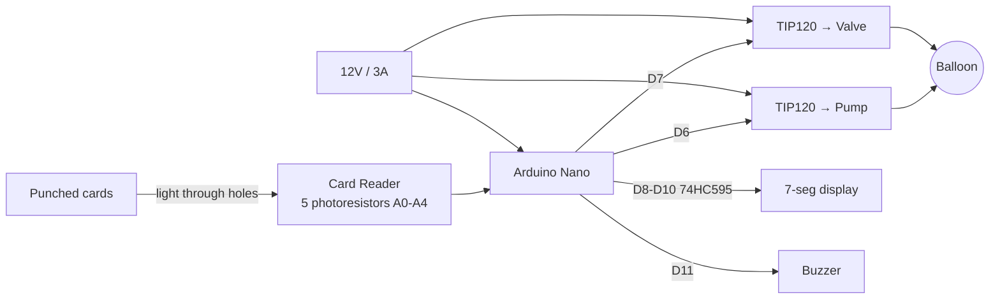

# Overview & BOM

This is the top of the **Build Guide** — the reproducible-rebuild half of the
site. It describes the BoomBalloon device as four cooperating modules and gives
the single, authoritative **bill of materials (BOM)**. Each module has its own
page; wiring and firmware get dedicated pages too.

- [Card reader](modules/card-reader.md) — *Kartenmodul* (card module)
- [Display](modules/display.md) — *Displaymodul*
- [Control board](modules/control-board.md) — *Steuermodul* (control module, the hub)
- [Enclosure](enclosure.md) — *Gehäuse* (housing)
- [Wiring & pin map](wiring-pinmap.md) — the master pin map (single source of truth)
- [Firmware — build & flash](firmware-build.md)

## System overview

At the centre of the device is an **Arduino Nano** (ATmega328P). Three
electronic modules plug into it, and everything lives inside a 3D-printed
housing:

1. The **card reader** optically senses which card is inserted. Five 3 mm LEDs
   (the *Lichtmodul*, light module) shine through the card onto five
   photoresistors (the *Fotomodul*, photo module); the pattern of light/dark
   spots encodes a 5-bit card value on analog inputs `A0`–`A4`.
2. The **control board** (*Steuermodul*) is the physical hub. The Arduino sits
   on it, and two TIP120 Darlington channels switch the 12 V loads: a membrane
   pump that **inflates** the balloon and a solenoid valve that **deflates** it.
   The card-reader and display connectors also land here.
3. The **display** (*Displaymodul*) is a single 20 mm 7-segment digit driven by
   a 74HC595 shift register, plus a piezo buzzer for game sounds.
4. The **enclosure** holds the balloon, the display window, the card slot, and
   the pump/valve mounts.

Power comes from a single **12 V / 3 A** supply. The 12 V rail feeds the pump
and valve; the Arduino derives the 5 V logic rail; the card-reader's *Fotomodul*
runs at **3.3 V** for a stable analog reference. The exact pin assignments are
on the [wiring & pin map](wiring-pinmap.md) page — the authoritative source for
all connections.

The block diagram below shows how the four modules connect through the Arduino Nano, using the verified pin map (photoresistor inputs, pump/valve/display/buzzer outputs, and the shared 12 V supply):

For how the software drives all this during play, see
[How It Works](../how-it-works.md); for the card encoding scheme, see the
[Optical Code System](../reference/optical-codes.md).

## Bill of materials

This table is the authoritative BOM for the electronics. Part numbers and
suppliers below were reconciled against the original order sheet
([`hardware/bom/20170825_Bestellliste.xlsx`](https://github.com/d-rk/boomballon/blob/main/hardware/bom/20170825_Bestellliste.xlsx),
supplier mostly Reichelt). Datasheets for the numbered parts live under
[`hardware/datasheets/`](https://github.com/d-rk/boomballon/tree/main/hardware/datasheets).

| Component | Role | Qty | Part / supplier |
|---|---|---|---|
| Arduino Nano (ATmega328P) | Controller | 1 | Keywish Nano (original prototype used an Arduino Micro) |
| 12 V / 3 A PSU | Power | 1 | generic (Amazon) |
| DC socket (switched) | Power input | 1 | BKL 072342 |
| Toggle switch | On/off | 1 | MS-165 series |
| Membrane/vacuum pump | Inflate | 1 | AIRPO D2028B (12 V) |
| Solenoid valve | Deflate | 1 | CEME 5000EN1,5P |
| TIP120 Darlington | Pump/valve switching | 2 | STM (Reichelt) |
| 1N4004 diode | Flyback across each coil | 2 | — |
| 2.2 kΩ resistor | Transistor base | 2 | metal film (METALL 2,20K) |
| 74HC595 | Display shift register | 1 | SMD HC 595 |
| 7-seg 20 mm (common cathode) | Display digit | 1 | SC08-11 |
| Piezo buzzer | Audio | 1 | EKULIT AL-60P12 |
| Photoresistor | Card sensing | 5 | Reichelt A 905014 |
| 10 kΩ resistor | Photocell divider | 5 | Bürklin 28 E497 |
| 3 mm LED | Card illumination | 5 | Reichelt LED EL 3-11250KW |
| 330 Ω resistor | LED limiting (Lichtmodul) | 5 | SMD 1206 |
| 330 Ω resistor | Segment limiting (Display) | 8 | SMD 1206 |
| Headers / stacking strips | Inter-module connectors | — | MPE-Garry / STAPELLEISTE (Reichelt) |
| Polycarbonate window | Display pane | 1 | Reely (Conrad 229802) |
| 3D-printed housing | Enclosure | 1 set | see [Enclosure](enclosure.md) |

!!! note "Photocell divider resistor: 10 kΩ, not 330 Ω (source conflict)"
    The Fotomodul parts list (`hardware/card-reader/Artikelnummern.txt`)
    specifies **10 kΩ** (Bürklin 28 E497) for the photocell **voltage divider**,
    while the Fritzing sketch and the order sheet
    (`hardware/bom/20170825_Bestellliste.xlsx`) both show 330 Ω. 10 kΩ is the
    electrically correct divider value — build with 10 kΩ. See the
    [card reader page](modules/card-reader.md) for details.

### Cost

Across the three prototype build sets, aggregate spend was on the order of
**~€577**. The dominant cost was never the electronics (which total only a few
tens of euros per unit) but the **enclosure**: the 3D-printed housing quotes
from i.materialise and Rapid Object ran to hundreds of euros per set and
ultimately cost-blocked a polished production housing. See the
[Enclosure](enclosure.md) page for that history.
