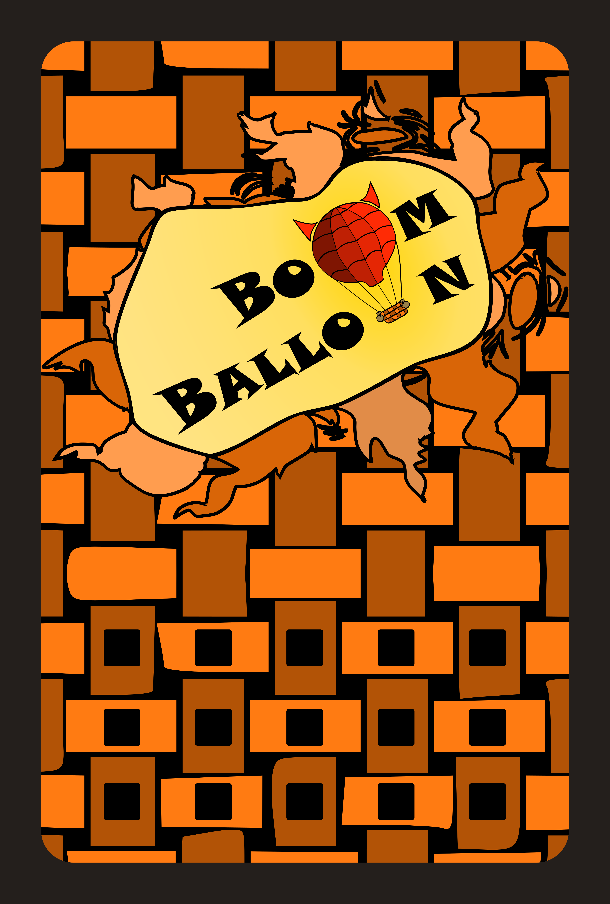
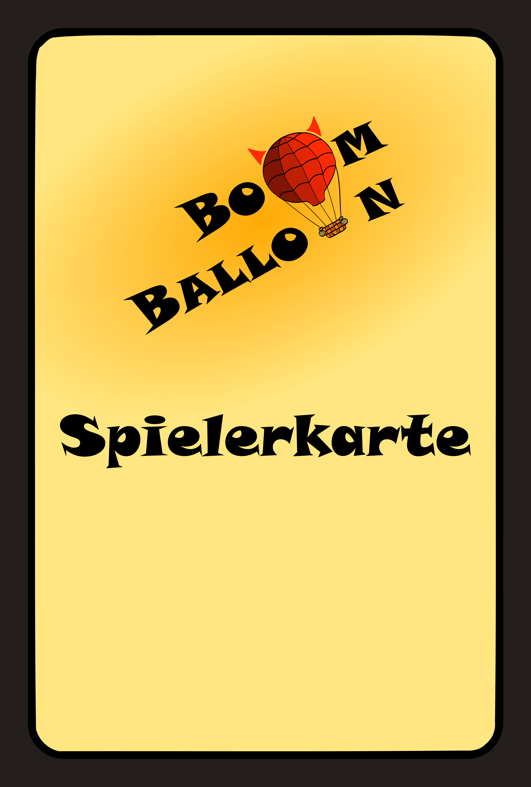
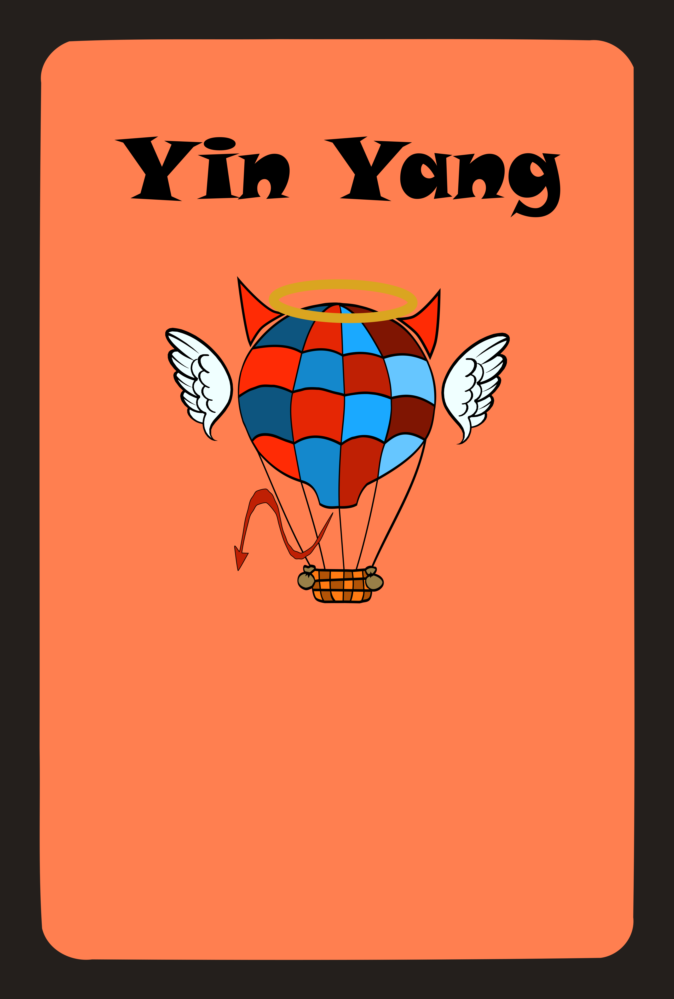

# The Card Deck

This page is the **authoritative catalog** of the BoomBalloon deck. Every card's German name, English gloss, printed face value, optical code, firmware effect, and deck count is listed here, cross-verified against the firmware and the design spreadsheets. Other documents that need the deck (including `cards/README.md` in the repository) point back to this page.

{ loading=lazy }

## What a card is

Every card is a printed rectangle with a machine-readable hole pattern:

- **Physical size:** 90 × 60 × 1 mm.
- **Holes:** 3 mm in diameter, spaced 10 mm apart.
- **Code:** 5 hole positions, so each card carries a **5-bit optical code** (a hole present or absent at each position). The card reader scans this pattern as the card slides in. See the [Optical Code System](../reference/optical-codes.md) reference for the bit layout and mirror-handling rules.

!!! note "Face value is thematic, not literal"
    The number printed on a card (its **face value**) is part of the game's theme and story. It is **not** the same as the internal **firmware effect** — the actual change applied to the modelled balloon volume. Always treat the firmware effect column below as the source of truth for what a card does.

## The catalog

| German name | English gloss | Face value | Code | Firmware effect | Count |
|---|---|---|---|---|---|
| Hochdruckgebiet 10 | High-pressure zone (deflate) | 10 | 1 | `VolumeCard(-15,200)` ~−15% | 6 |
| Hochdruckgebiet 20 | High-pressure zone | 20 | 2 | `VolumeCard(-25,200)` ~−25% | 6 |
| Kurswechsel 30 | Change of course (down) | −30 | 3 | `ChangeDirectionCard(-25,200)` deflate + reverse | 4 |
| Engelsbote 30 | Angel's messenger | −30 | 4 | `AngelCard(-25,50)` delayed relief next round | 3 |
| Blockierung | Blocking / miss round | — | 5 | `MissRoundCard()` skip a card (50%) | 2 |
| Tiefdruckgebiet 20 | Low-pressure zone (inflate) | +20 | 6 | `VolumeCard(30,200)` ~+30% | 6 |
| Tiefdruckgebiet 30 | Low-pressure zone | +30 | 7 | `VolumeCard(40,200)` ~+40% | 6 |
| Kurswechsel 40 | Change of course (up) | +40 | 9 | `ChangeDirectionCard(40,200)` inflate + reverse | 4 |
| Teufelsbote 40 | Devil's messenger | +40 | 10 | `DevilCard(40,50)` malicious inflate (50%) | 3 |
| Weltuntergang | Apocalypse | — | 11 | `SuddenDeathCard()` repeatedly fills to max | 2 |
| Zwiegespalten 50 | Torn / fifty-fifty | ±50 | 13 | `FiftyFiftyCard(100)` random ±50% | 3 |
| Berg und Tal 20 | Up hill and down | 20/20 | 14 | `UpDownCard(35,200)` oscillate | 3 |
| Yin Yang | Yin & Yang | — | 27 | `PushToLimitCard(255)` push to 99% | 1 |
| 1–5 Spieler | Player 1–5 | — | 15/17/19/21/23 | player-select / target card | 1 each |

## Deck total and the player cards

The full deck is **about 54 cards**: **49 effect cards** (the play cards, or *Spielkarten*) plus **5 player cards** (*Spielerkarten*), for **54** in total.

The player cards, **`1 Spieler`…`5 Spieler`**, do two jobs:

- During play they act as **target cards** — you insert one to choose which player a target-based card (Teufelsbote, Blockierung, Weltuntergang) affects.
- The **`2 Spieler`…`5 Spieler`** cards additionally **choose the game size** when inserted at startup (see [Rules → Setting up a game](rules.md#setting-up-a-game)).

{ loading=lazy }

The **Yin Yang** card is a rare single wildcard that pushes the modelled volume all the way to the limit:

{ loading=lazy }
