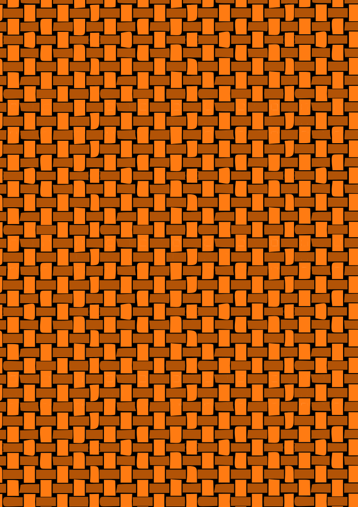

# How It Works

BoomBalloon looks like a toy and behaves like a small embedded system. There is a real balloon, a real pump, and a real valve — but the thing everyone is nervous about, the balloon's fill level, is tracked entirely in software. This page explains the model behind the game, how the machine reads its cards, and what actually happens during a single turn.

## The balloon-volume model

The number that decides who loses is a **software model of the balloon's volume**, expressed as a percentage. The firmware does not measure air pressure and it does not sense the balloon at all. Instead, it keeps a running total based on time:

- When the **pump** runs, the modelled volume rises in proportion to how long it runs.
- When the **valve** opens, air escapes and the modelled volume falls, again over time.

In other words, the volume is a **time-integral of pump and valve activity** — the machine knows how much it has inflated and deflated because it is the one doing the inflating and deflating. When the modelled volume passes **100 %**, the balloon is considered burst and the current player loses.

!!! note "No pressure sensor"
    Because the volume is modelled rather than measured, there is no feedback loop from the physical balloon. The codebase does contain a `SoundDetector` class — the seed of a pop-detection idea — but it is **not used** by the game. The real balloon is there for the drama; the software is the referee.

This is a deliberate design: it keeps the hardware cheap and reliable, and it means the machine can also raise or lower the *simulated* volume for cards whose effect is about strategy rather than a literal puff of air.

## The cards are the input

BoomBalloon has no buttons for gameplay. The only way a player interacts with the machine is by inserting a **card (Spielkarte, "playing card")** into the reader. Each card carries a **5-bit optical code** — a pattern of punched holes — that the reader scans as the card slides in.

{ loading=lazy }

A small, well-defined code space (5 bits) keeps the reader simple and the deck easy to print, while still giving enough distinct values to cover every card type in the game. The firmware handles the messy realities of a physical card being pushed in by hand: it **debounces** the optical signals so a shaky insertion is not misread, and it correctly interprets a card inserted the "wrong" way by handling the **180°-rotation mirror** of the code.

For the full specification — the bit layout, how the codes map to card effects, and the mirror-handling rules — see the [Optical Code System](reference/optical-codes.md) reference, which is the single source of truth for the encoding.

## A single turn, step by step

{ loading=lazy }

Here is what happens from the moment it is your turn:

1. **Insert your card.** You slide a card into the reader. The optical sensors pick up the hole pattern as the card passes.
2. **The firmware decodes it.** After debouncing the signals and correcting for insertion direction, the 5-bit code is resolved to a specific card.
3. **Pick a target, if the card asks.** Some cards act on a chosen opponent rather than yourself. In that case the card's effect is directed at another player (selected via a player card, *Spielerkarte*), so you can push someone else toward the burst.
4. **The effect plays out.** The decoded card is turned into a `Card` object that applies its effect — running the pump to inflate, opening the valve to deflate, or adjusting the simulated volume — accompanied by a **buzzer** sound and an **animation on the 7-segment display**.
5. **Pull the card out.** Removing the card clears the reader and ends the action.
6. **Next player.** Play passes on. The modelled volume carries over, a little higher or lower than before — and everyone eyes the balloon.

{ loading=lazy }

The loop repeats, card after card, until someone plays the card that pushes the modelled volume past 100 % on their own turn. That player loses — and the balloon, at last, gets to pop.

---

Want more detail? The [card deck](gameplay/card-deck.md) covers what each card does, the [build guide](build-guide/overview-bom.md) covers the hardware, and the [firmware architecture](reference/firmware-architecture.md) reference explains how the code is put together.
