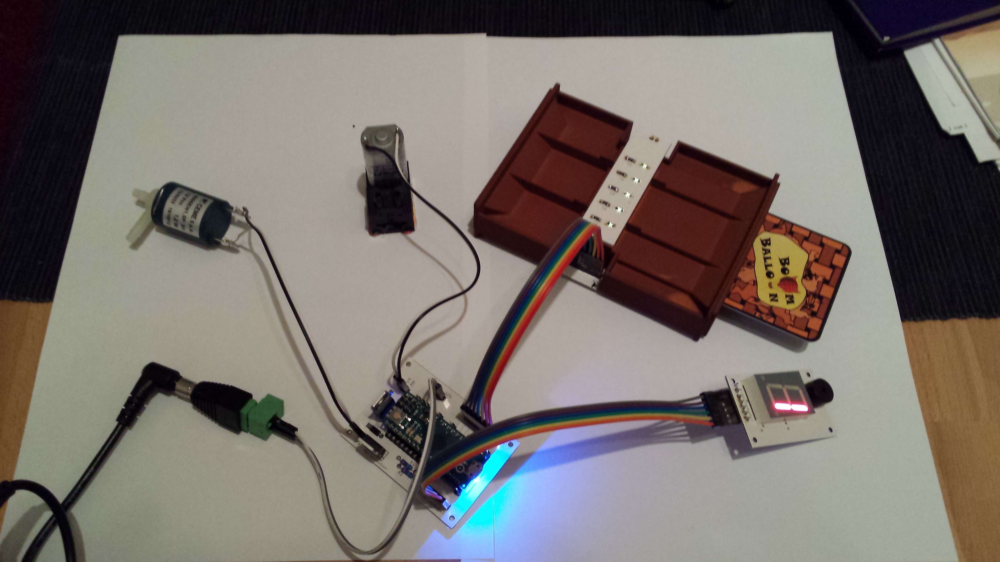
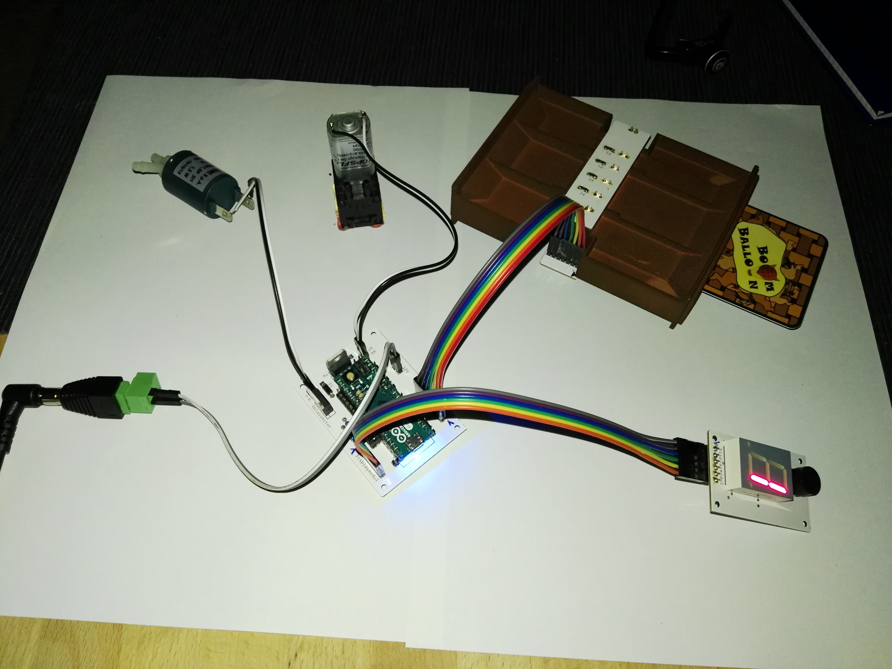
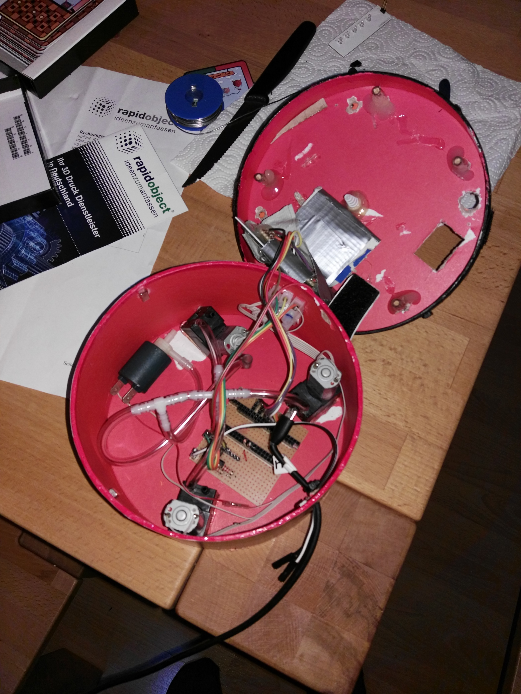

# BoomBalloon

{ loading=lazy }

*The unit pictured is the earlier [Arduino Micro prototype](story.md#the-controller-from-micro-to-nano) (the "prototype 2" generation); the current firmware targets the Arduino Nano (ATmega328P).*

**An electronic party game where players inflate a real balloon with punched cards until it bursts — whoever is holding the moment it pops loses.**

BoomBalloon turns a game of nerve into hardware you can feel. Every card you play sends a puff of air into a genuine rubber balloon. It swells, the tension rises, and nobody knows which card will be the one too many. It is a *Buckaroo!*-style dare for the electronics age: a microcontroller, a pump, a valve, and a deck of optically-coded cards that the machine reads all by itself.

## In 30 seconds

- **Insert a coded card.** Each card is punched with a 5-bit optical pattern that the reader scans as it slides in.
- **The firmware acts.** It decodes the card and drives a 12 V pump to inflate the balloon — or opens a valve to let air back out.
- **The volume climbs.** A software model tracks the balloon's fill level as a percentage, ticking toward 100 % with every risky card.
- **Burst = you lose.** Cross 100 % on your turn and the balloon pops. Last player standing wins.

[How It Works](how-it-works.md){ .md-button .md-button--primary }
[The Card Deck](gameplay/card-deck.md){ .md-button }
[Build Guide](build-guide/overview-bom.md){ .md-button }

## A look inside

{ loading=lazy }

{ loading=lazy }

{ loading=lazy }

{ loading=lazy }

{ loading=lazy }

---

BoomBalloon was a hobby and pre-commercial project built between roughly 2016 and 2018. It reached a working, multi-unit prototype with complete firmware before enclosure costs stalled it. [Read the full story](story.md).
