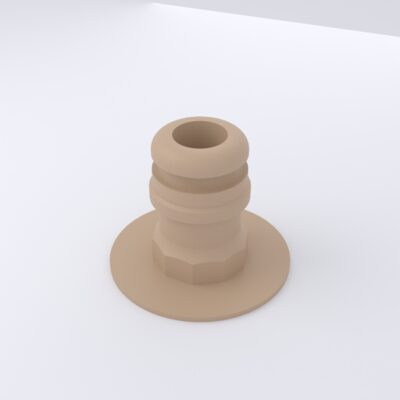
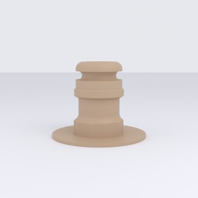
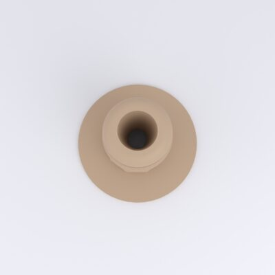
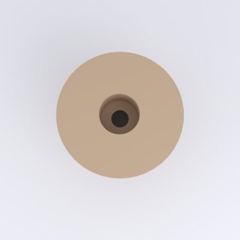
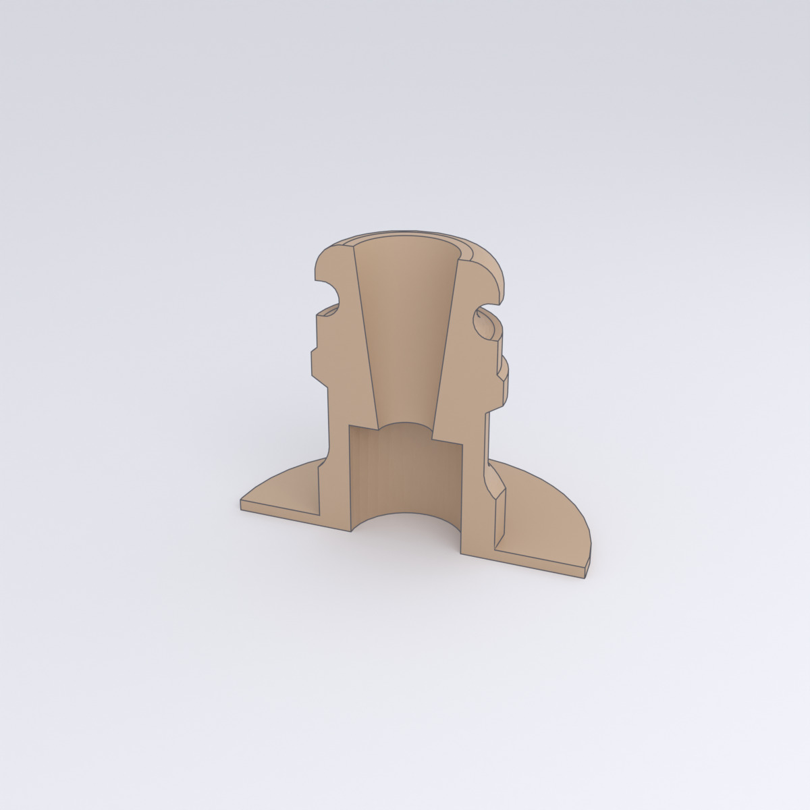
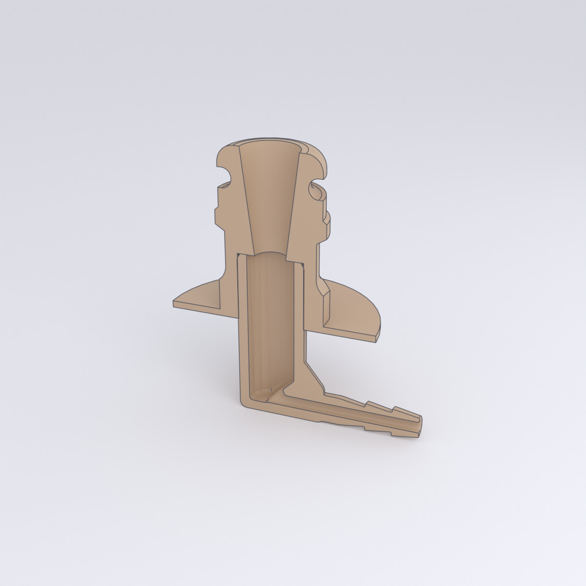

# Balloon Adapter

*Ballon-Aufsatz* — the barbed balloon-neck adapter that mounts on top of the
[upper housing](upper-housing.md), centred over its balloon-nozzle passage. A
round flange seats on the top face; the ridged spigot rises through the central
hole in the [roof](roof.md), and the balloon's neck stretches over the barbs.
Air from the pump reaches the balloon through the central bore. The octagonal
mid-collar gives a wrench/finger grip for seating it.

[{ loading=lazy }](../../assets/img/enclosure/aufsatz-iso-045.jpg){ .glightbox data-gallery="aufsatz" data-title="Balloon adapter — iso" }
[{ loading=lazy }](../../assets/img/enclosure/aufsatz-front.jpg){ .glightbox data-gallery="aufsatz" data-title="Balloon adapter — profile (barbs)" }
[{ loading=lazy }](../../assets/img/enclosure/aufsatz-top.jpg){ .glightbox data-gallery="aufsatz" data-title="Balloon adapter — top (bore)" }
[{ loading=lazy }](../../assets/img/enclosure/aufsatz-bottom.jpg){ .glightbox data-gallery="aufsatz" data-title="Balloon adapter — underside (flange)" }

**Bounding box:** ≈ ⌀32 × 25 mm (round flange diameter × height).

## Cutaway

A section down the centreline shows the through-bore: the wide seat at the top
where the balloon neck sits, the barb ridges that grip it, and the counterbored
inlet under the flange. The second section adds the [hose nozzle](nozzle.md) in
its assembled position, so the full air path is visible — from the balloon seat,
down the adapter bore, through the nozzle elbow, and out to the barbed tubing
fitting.

<figure markdown="span">
{ loading=lazy }
<figcaption>Side cut — through the bore, barbs, and mounting flange</figcaption>
</figure>
<figure markdown="span">
{ loading=lazy }
<figcaption>Adapter + nozzle — the continuous bore through both parts</figcaption>
</figure>

## CAD & print files

- STL: [`balloon-adapter.stl`](https://github.com/d-rk/boomballon/blob/main/hardware/enclosure/stl/balloon-adapter.stl)
- STEP: [`balloon-adapter.stp`](https://github.com/d-rk/boomballon/blob/main/hardware/enclosure/step/balloon-adapter.stp) (tessellated from the mesh)
