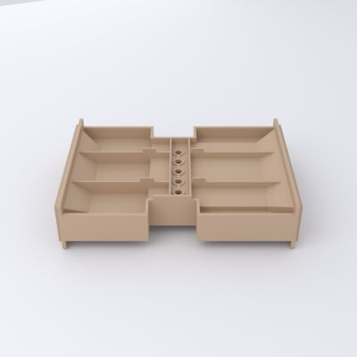
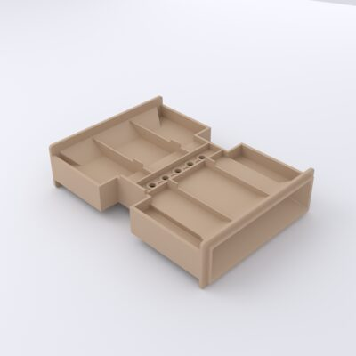
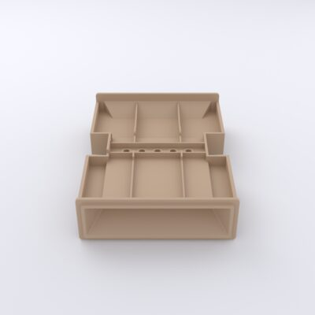
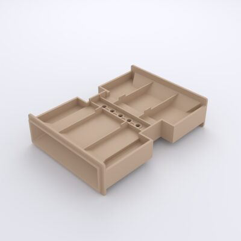
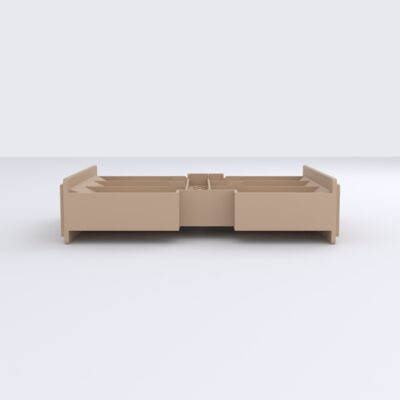
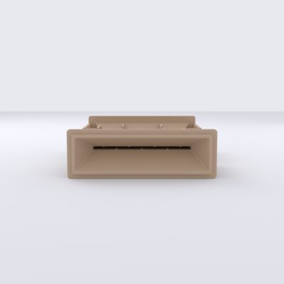
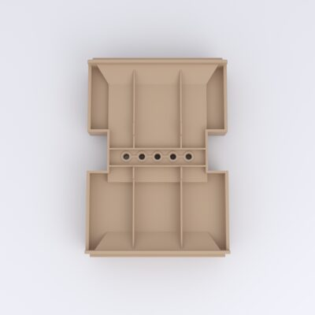
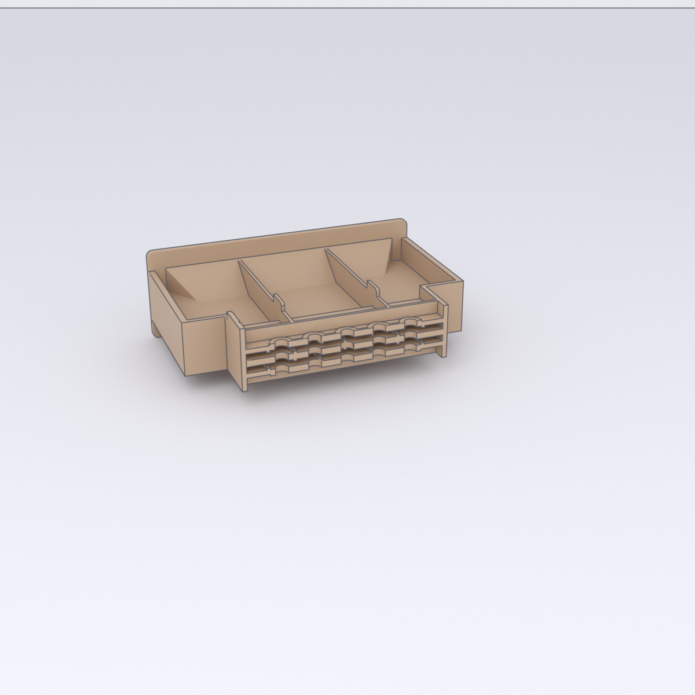
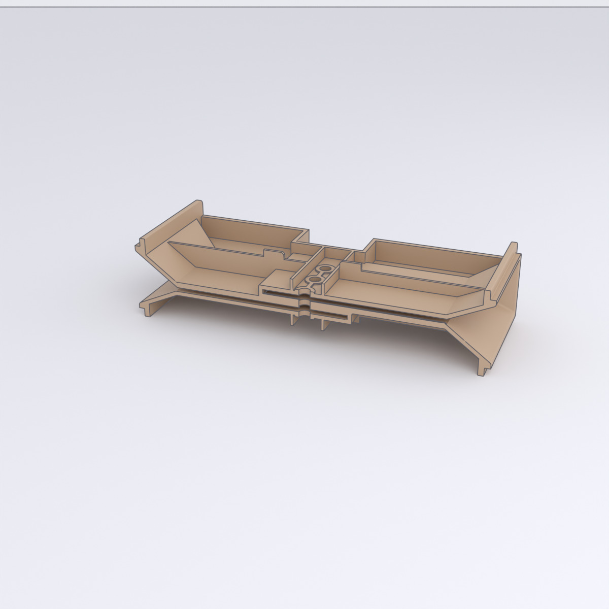

# Card-Module Housing

*Kartenmodul-Gehäuse* — the tray that carries the optical [card reader](../modules/card-reader.md).
It is an H-shaped structure: two chambers (for the *Lichtmodul* LEDs and the
*Fotomodul* photoresistors) bridged by the drilled slot the card slides through.
It nests inside the [lower housing](lower-housing.md), aligned with the card slot
in the wall.

[{ loading=lazy }](../../assets/img/enclosure/kartenmodul-iso-000.jpg){ .glightbox data-gallery="kartenmodul" data-title="Card module — iso 0°" }
[{ loading=lazy }](../../assets/img/enclosure/kartenmodul-iso-045.jpg){ .glightbox data-gallery="kartenmodul" data-title="Card module — iso 45°" }
[{ loading=lazy }](../../assets/img/enclosure/kartenmodul-iso-090.jpg){ .glightbox data-gallery="kartenmodul" data-title="Card module — iso 90°" }
[{ loading=lazy }](../../assets/img/enclosure/kartenmodul-iso-135.jpg){ .glightbox data-gallery="kartenmodul" data-title="Card module — iso 135°" }
[{ loading=lazy }](../../assets/img/enclosure/kartenmodul-left.jpg){ .glightbox data-gallery="kartenmodul" data-title="Card module — profile" }
[{ loading=lazy }](../../assets/img/enclosure/kartenmodul-back.jpg){ .glightbox data-gallery="kartenmodul" data-title="Card module — end" }
[{ loading=lazy }](../../assets/img/enclosure/kartenmodul-bottom.jpg){ .glightbox data-gallery="kartenmodul" data-title="Card module — underside" }

**Bounding box:** ≈ 90 × 126 × 30 mm.

## Interior

Sectioning the part reveals the two chambers, the dividing walls, and the drilled
bridge that holds the five photoresistors either side of the card path.

<figure markdown="span">
{ loading=lazy }
<figcaption>Front cut — through the chambers</figcaption>
</figure>
<figure markdown="span">
{ loading=lazy }
<figcaption>Side cut — through the drilled photoresistor bridge</figcaption>
</figure>

## CAD & print files

- STL: [`card-module-housing.stl`](https://github.com/boomballoon/boomballoon/blob/main/hardware/enclosure/stl/card-module-housing.stl)
- STEP: [`card-module-housing.stp`](https://github.com/boomballoon/boomballoon/blob/main/hardware/enclosure/step/card-module-housing.stp)
