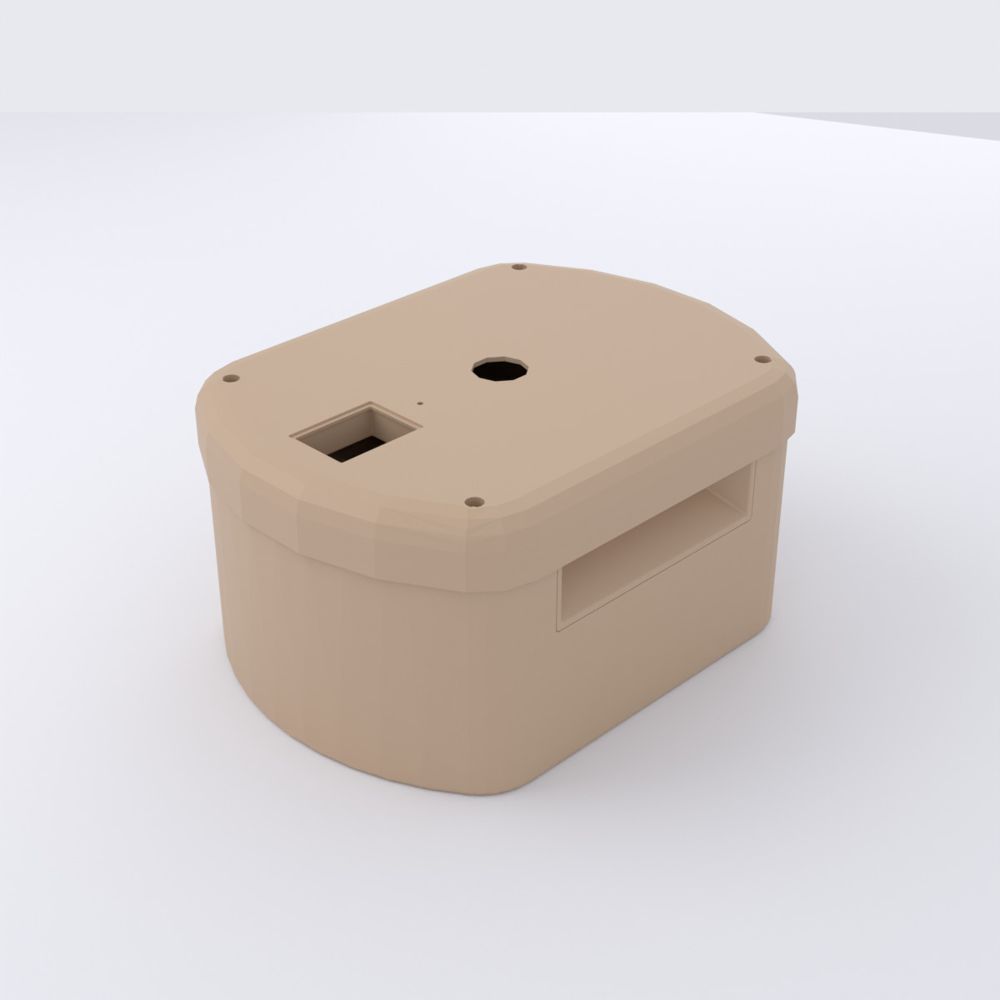

# Enclosure

The enclosure (*Gehäuse*, housing) is the 3D-printed body that holds everything
together: the balloon and its nozzle, the display window, the card slot, and the
pump/valve mounts. It is the most visually distinctive — and by far the most
expensive — part of the project.

<figure markdown="span">
{ loading=lazy }
<figcaption>The full device, rendered from the STL models (upper + lower housing + card module)</figcaption>
</figure>

## Parts

The housing splits into several printed parts plus one cut window. Each printed
part has its own page with renders, dimensions, and CAD downloads:

| Part | German name | Role |
|---|---|---|
| [Upper housing](upper-housing.md) | *Gehäuse Oberteil* | upper body shell — carries the display window and nozzle passage |
| [Lower housing](lower-housing.md) | *Gehäuse Unterteil* | lower body shell / base — houses the pump and valve |
| [Roof](roof.md) | *Dach-Spitz* | top cap over the balloon nozzle |
| [Hose nozzle](nozzle.md) | *Schlauch-Stutzen* | balloon nozzle mount (elbow + barbed fitting) |
| [Card-module housing](card-module.md) | *Kartenmodul-Gehäuse* | tray/shroud for the card slot and optical reader |
| [Full assembly](assembly.md) | *Device komplett* | the parts fitted together, with cutaways |
| Display window | *Scheibe* | polycarbonate pane (Reely, cut to size) — **not printed** |

The pump and valve mount inside the lower housing; the display window is a
polycarbonate pane (Reely, from Conrad) fitted over the 7-segment display.

## CAD files

Neutral-format CAD exports are committed to the repository, so you don't need
the original Creo/Pro-E files to print or machine the parts:

- **STEP** (`.stp`, for CAD/CAM):
  [`hardware/enclosure/step/`](https://github.com/d-rk/boomballon/tree/main/hardware/enclosure/step)
- **STL** (`.stl`, for slicing/printing):
  [`hardware/enclosure/stl/`](https://github.com/d-rk/boomballon/tree/main/hardware/enclosure/stl)

!!! note "The renders are reproducible"
    Every render on these pages is generated from the STL models by
    [`media/enclosure/render.py`](https://github.com/d-rk/boomballon/blob/main/media/enclosure/render.py);
    [`render-all.sh`](https://github.com/d-rk/boomballon/blob/main/media/enclosure/render-all.sh)
    regenerates the exact set. Requires Blender ≥ 4.2.

## Print / quote history — cost-blocked

The enclosure is where the prototype budget went. The parts were quoted by two
professional 3D-printing services, both of which came back too expensive to
justify a polished production housing:

- **i.materialise** — polished-finish quotes ran roughly €100–135 for the upper
  and lower housing shells *each*, plus the card module, roof, and nozzle.
- **Rapid Object** — comparable or higher quotes; the order sheet flags these
  rows outright as *ZU TEUER* (too expensive).

Together with the electronics, these quotes drove the **~€577** aggregate
prototype spend (see the [BOM](../overview-bom.md#cost)). A future rebuild would
most likely print the housing in-house (FDM/SLA) from the committed STL files
rather than order polished prints.
