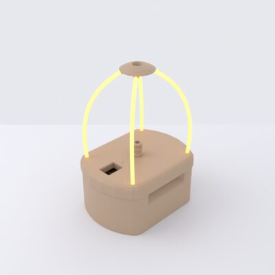
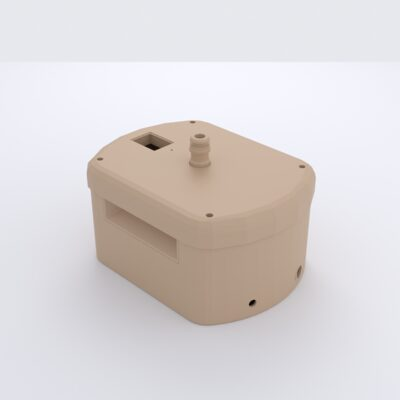
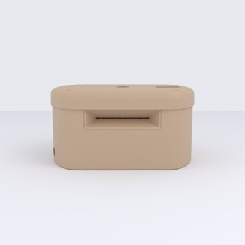
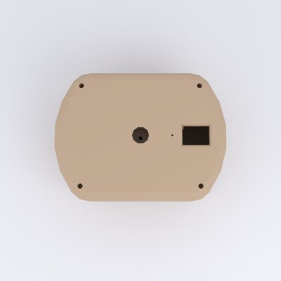
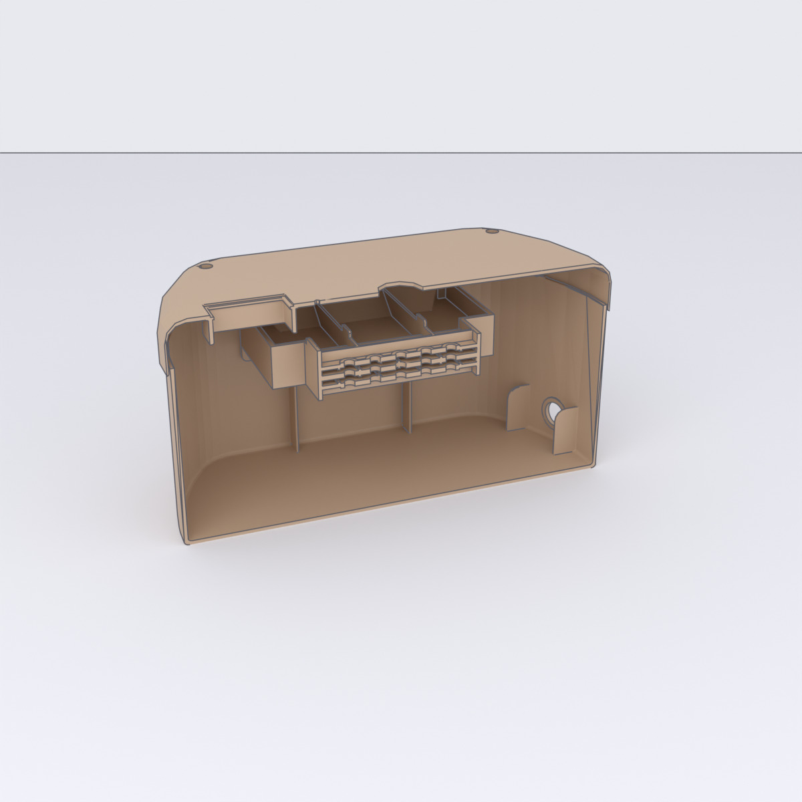
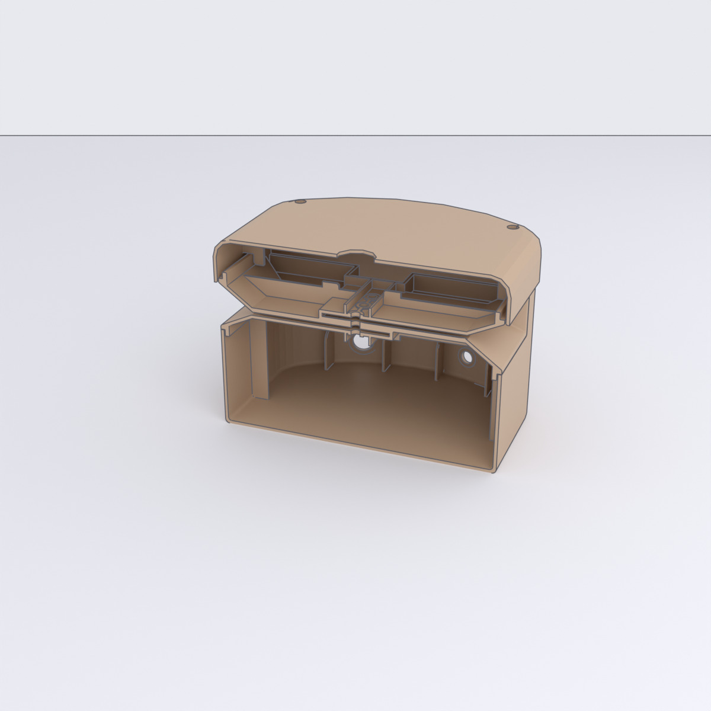
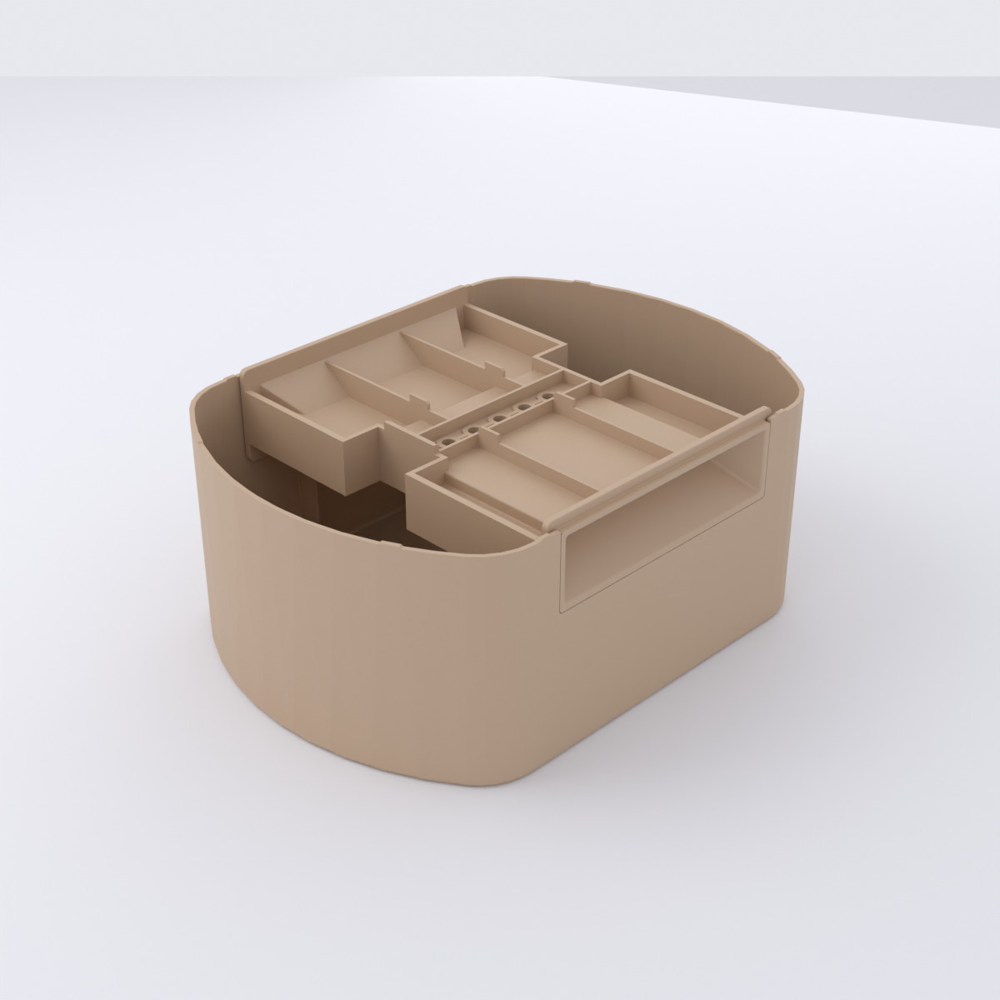
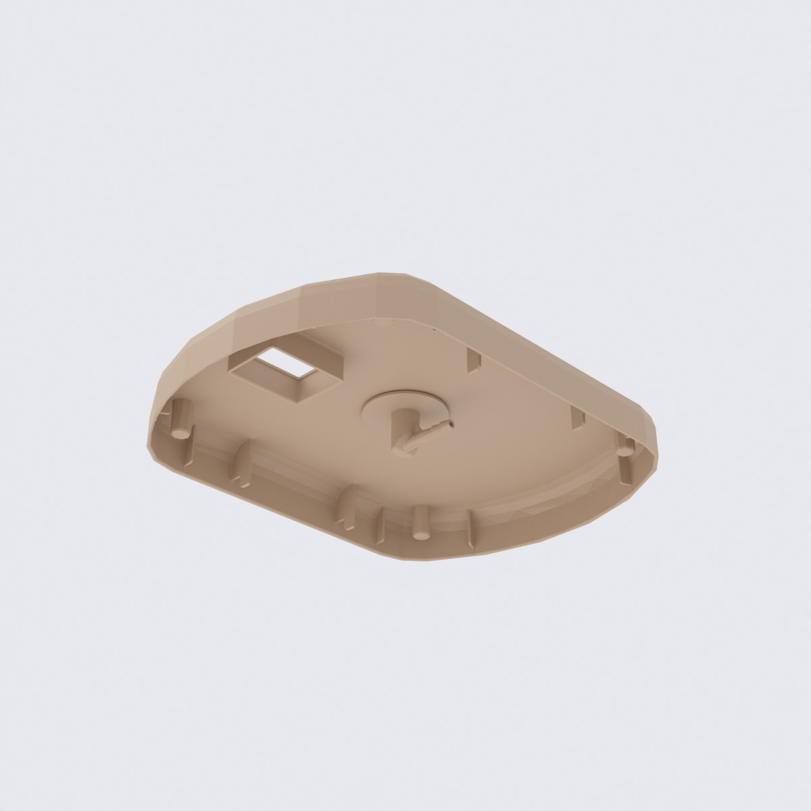

# Enclosure

The enclosure (*Gehäuse*) is the 3D-printed body that holds everything
together: the balloon and its nozzle, the display window, the card slot, and the
pump/valve mounts.

## Full assembly

The complete device body, all printed parts fitted together.

[{ loading=lazy }](../../assets/img/enclosure/assembly-iso-045.jpg){ .glightbox data-gallery="assembly" data-title="Assembly — iso 45°" }
[{ loading=lazy }](../../assets/img/enclosure/assembly-iso-135.jpg){ .glightbox data-gallery="assembly" data-title="Assembly — iso 135°" }
[{ loading=lazy }](../../assets/img/enclosure/assembly-front.jpg){ .glightbox data-gallery="assembly" data-title="Assembly — front" }
[{ loading=lazy }](../../assets/img/enclosure/assembly-top.jpg){ .glightbox data-gallery="assembly" data-title="Assembly — top" }

**Overall size:** ≈ 172 × 130 × 237 mm (width × depth × height).

### Interior

Cutaway and partial views of the housing, showing how the card module, balloon
adapter, and hose nozzle sit inside.

<figure markdown="span">
{ loading=lazy }
<figcaption>Front cut — card module inside the cavity</figcaption>
</figure>
<figure markdown="span">
{ loading=lazy }
<figcaption>Side cut — the adapter and nozzle bore on the centre axis</figcaption>
</figure>

<figure markdown="span">
{ loading=lazy }
<figcaption>Lower half, from above — card module in the base</figcaption>
</figure>
<figure markdown="span">
{ loading=lazy }
<figcaption>Upper half, from below — nozzle and adapter passage</figcaption>
</figure>

## Parts

The housing splits into several printed parts plus one cut window. Each printed
part has its own page with renders, dimensions, and CAD downloads:

| Part | German name | Role |
|---|---|---|
| [Upper housing](upper-housing.md) | *Gehäuse Oberteil* | upper body shell — carries the display window and nozzle passage |
| [Lower housing](lower-housing.md) | *Gehäuse Unterteil* | lower body shell / base — houses the pump and valve |
| [Roof](roof.md) | *Dach-Spitze* | top cap over the balloon nozzle |
| [Hose nozzle](nozzle.md) | *Schlauch-Stutzen* | balloon nozzle mount (elbow + barbed fitting) |
| [Balloon adapter](balloon-adapter.md) | *Ballon-Aufsatz* | barbed balloon-neck adapter mounted on top of the upper housing |
| [Card-module housing](card-module.md) | *Kartenmodul-Gehäuse* | tray/shroud for the card slot and optical reader |
| Display window | *Scheibe* | polycarbonate pane — **not printed** |

The pump and valve mount inside the lower housing; the display window is a
polycarbonate pane fitted over the 7-segment display.

## CAD files

Neutral-format CAD exports are committed to the repository:

- **Full-assembly STEP:**
  [`full-assembly.stp`](https://github.com/boomballoon/boomballoon.github.io/blob/main/hardware/enclosure/step/full-assembly.stp)
- **STEP** (`.stp`, for CAD/CAM):
  [`hardware/enclosure/step/`](https://github.com/boomballoon/boomballoon.github.io/tree/main/hardware/enclosure/step)
- **STL** (`.stl`, for slicing/printing):
  [`hardware/enclosure/stl/`](https://github.com/boomballoon/boomballoon.github.io/tree/main/hardware/enclosure/stl)

!!! note "The renders are reproducible"
    Every render on these pages is generated from the STL models by
    [`media/enclosure/render.py`](https://github.com/boomballoon/boomballoon.github.io/blob/main/media/enclosure/render.py);
    [`render-all.sh`](https://github.com/boomballoon/boomballoon.github.io/blob/main/media/enclosure/render-all.sh)
    regenerates the exact set. Requires Blender ≥ 4.2.
