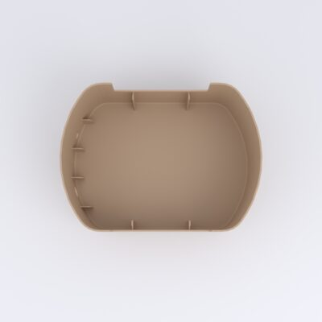
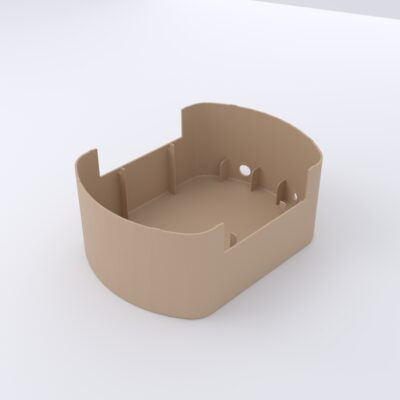
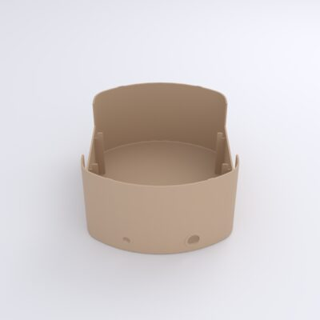
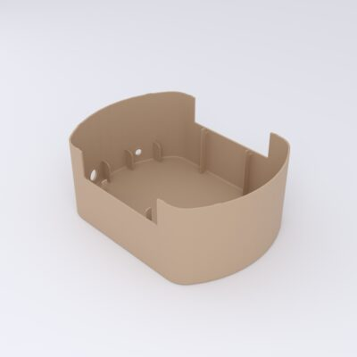

# Lower Housing

*Gehäuse Unterteil* — the lower body shell and base. It is the deep tub that
**houses the pump and valve** and the 12 V wiring, with cutouts in its wall for
the card slot and connectors. The [upper housing](upper-housing.md) caps it.

[{ loading=lazy }](../../assets/img/enclosure/gut-top.jpg){ .glightbox data-gallery="gut" data-title="Lower housing — top (into the tub)" }
[{ loading=lazy }](../../assets/img/enclosure/gut-iso-045.jpg){ .glightbox data-gallery="gut" data-title="Lower housing — iso" }
[{ loading=lazy }](../../assets/img/enclosure/gut-iso-180.jpg){ .glightbox data-gallery="gut" data-title="Lower housing — iso (rear)" }
[{ loading=lazy }](../../assets/img/enclosure/gut-iso-315.jpg){ .glightbox data-gallery="gut" data-title="Lower housing — iso (side)" }

**Bounding box:** ≈ 170 × 126 × 71 mm.

## CAD & print files

- STL: [`180123_bb_gut.stl`](https://github.com/d-rk/boomballon/blob/main/hardware/enclosure/stl/180123_bb_gut.stl)
- STEP: [`180123_bb_gut.stp`](https://github.com/d-rk/boomballon/blob/main/hardware/enclosure/step/180123_bb_gut.stp)
