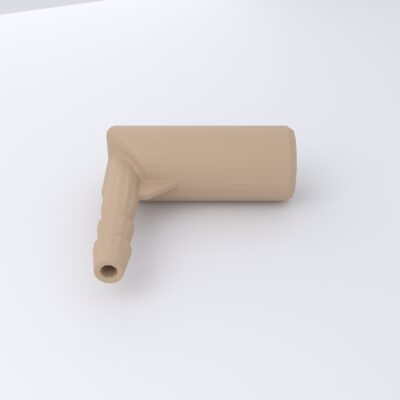
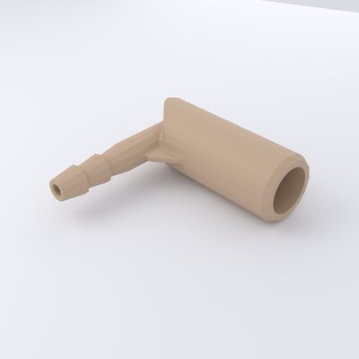
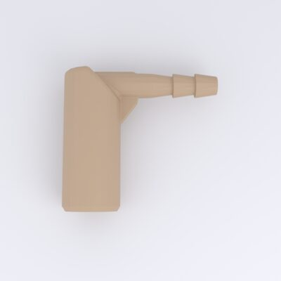

# Hose Nozzle

*Schlauch-Stutzen* — the balloon nozzle mount: a 90° elbow with a wide bore on
one arm (where the balloon neck seats) and a **barbed hose fitting** on the
other (for the pump/valve tubing). It mounts under the [roof](roof.md).

[{ loading=lazy }](../../assets/img/enclosure/stutzen-iso-000.jpg){ .glightbox data-gallery="stutzen" data-title="Hose nozzle — iso" }
[{ loading=lazy }](../../assets/img/enclosure/stutzen-iso-045.jpg){ .glightbox data-gallery="stutzen" data-title="Hose nozzle — iso (bore + barb)" }
[{ loading=lazy }](../../assets/img/enclosure/stutzen-bottom.jpg){ .glightbox data-gallery="stutzen" data-title="Hose nozzle — underside" }

**Bounding box:** ≈ 27 × 24 × 10 mm.

## CAD & print files

- STL: [`180123_bb_got_stutzen.stl`](https://github.com/d-rk/boomballon/blob/main/hardware/enclosure/stl/180123_bb_got_stutzen.stl)
- STEP: [`180123_bb_got_stutzen.stp`](https://github.com/d-rk/boomballon/blob/main/hardware/enclosure/step/180123_bb_got_stutzen.stp)
