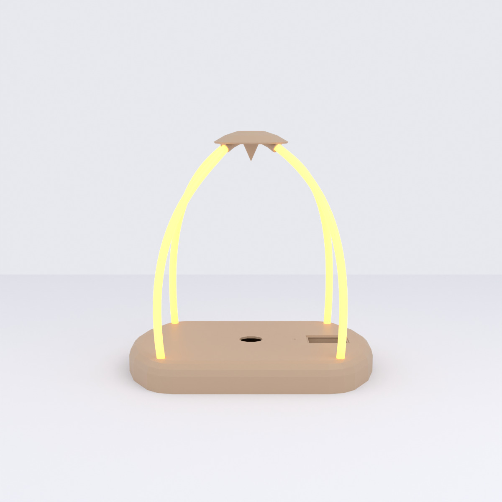
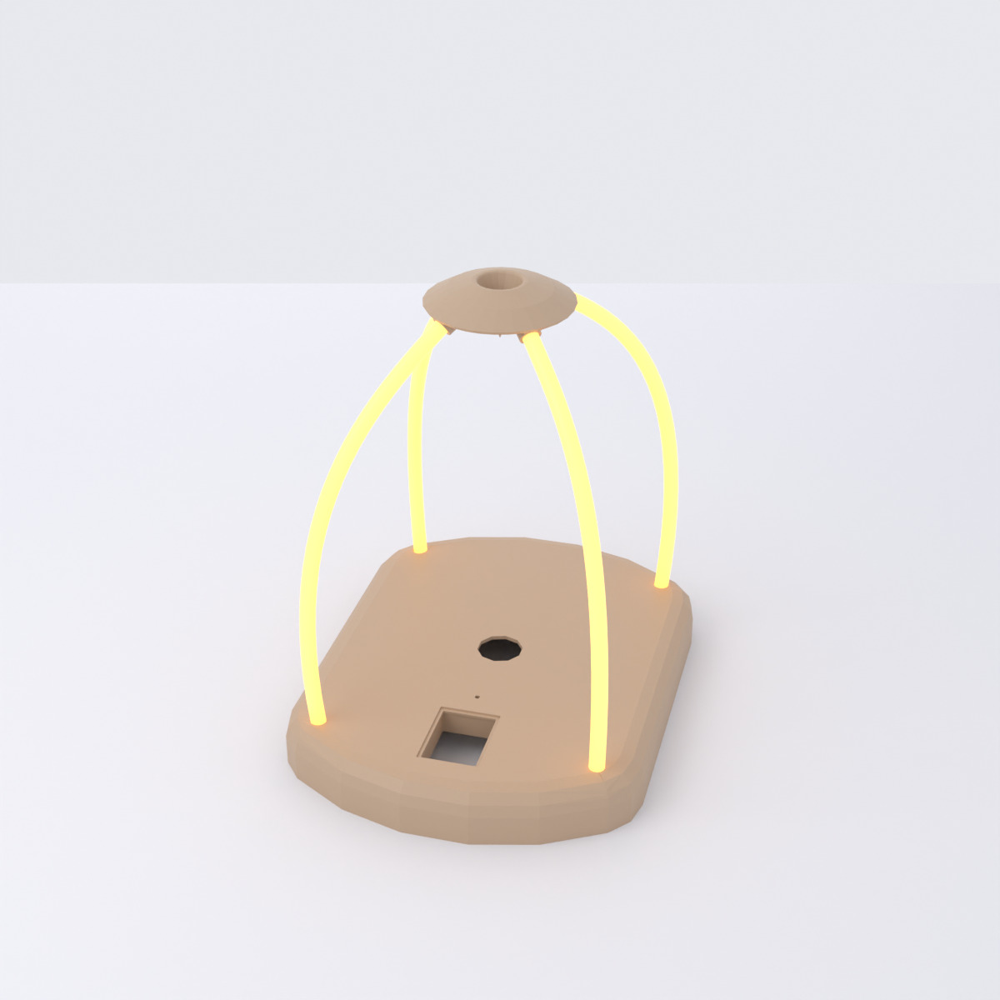

# Roof

*Dach-Spitze* — a small domed cap that floats above the device on four bent
Knicklichter. A spike points down from
its centre: the balloon inflates up toward it during the game, and touching
the spike is the maximum — inflate past it and the balloon bursts, ending the
game in a loss.

[{ loading=lazy }](../../assets/img/enclosure/dach-iso-000.jpg){ .glightbox data-gallery="dach" data-title="Roof — iso" }
[{ loading=lazy }](../../assets/img/enclosure/dach-left.jpg){ .glightbox data-gallery="dach" data-title="Roof — profile" }
[{ loading=lazy }](../../assets/img/enclosure/dach-bottom.jpg){ .glightbox data-gallery="dach" data-title="Roof — underside (legs)" }

**Bounding box:** ≈ 52 × 52 × 21 mm.

## Roof mount

The roof does not sit on the housing — it floats about 140 mm above it,
carried by four bent Knicklichter (flexible glow-stick arm bands). Each stick
leaves a corner hole of the [upper housing](upper-housing.md) near-vertically,
bows outward, and sweeps back in to hook into one of the roof's four leg
bores.

<figure markdown="span">
{ loading=lazy }
<figcaption>Front — the roof floating on its four sticks</figcaption>
</figure>
<figure markdown="span">
{ loading=lazy }
<figcaption>Iso — corner hole to leg-bore bend</figcaption>
</figure>

## CAD & print files

- STL: [`roof.stl`](https://github.com/boomballoon/boomballoon.github.io/blob/main/hardware/enclosure/stl/roof.stl)
- STEP: [`roof.stp`](https://github.com/boomballoon/boomballoon.github.io/blob/main/hardware/enclosure/step/roof.stp)
