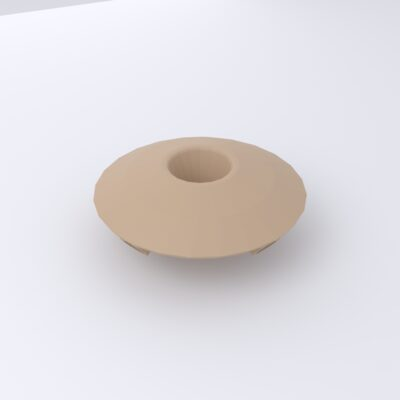
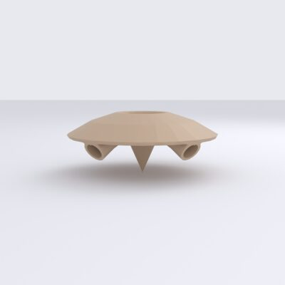
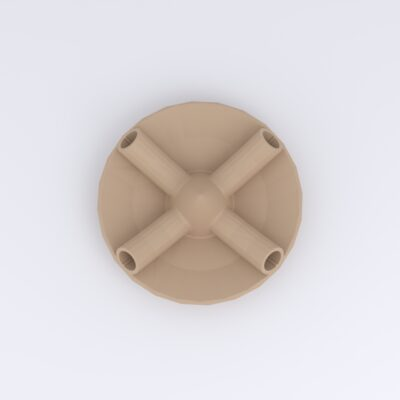

# Roof

*Dach-Spitze* — the domed top cap that sits over the balloon nozzle. Its central
hole passes the nozzle/balloon through the top of the device; four legs on the
underside locate it on the [upper housing](upper-housing.md).

[{ loading=lazy }](../../assets/img/enclosure/dach-iso-000.jpg){ .glightbox data-gallery="dach" data-title="Roof — iso" }
[{ loading=lazy }](../../assets/img/enclosure/dach-left.jpg){ .glightbox data-gallery="dach" data-title="Roof — profile" }
[{ loading=lazy }](../../assets/img/enclosure/dach-bottom.jpg){ .glightbox data-gallery="dach" data-title="Roof — underside (legs)" }

**Bounding box:** ≈ 52 × 52 × 21 mm.

## CAD & print files

- STL: [`roof.stl`](https://github.com/d-rk/boomballon/blob/main/hardware/enclosure/stl/roof.stl)
- STEP: [`roof.stp`](https://github.com/d-rk/boomballon/blob/main/hardware/enclosure/step/roof.stp)
