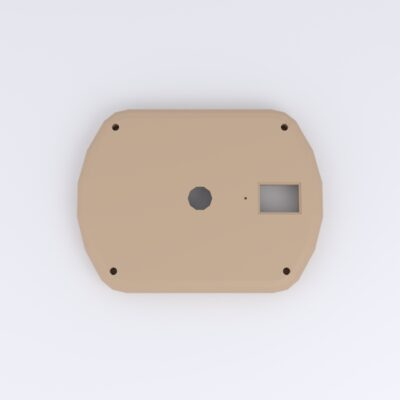
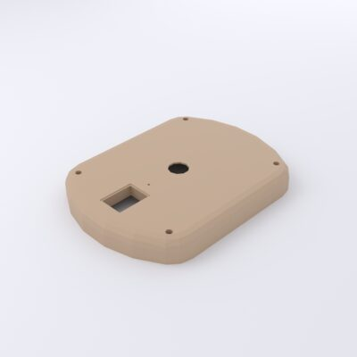
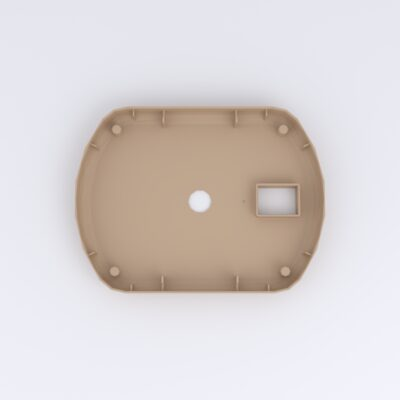

# Upper Housing

*Gehäuse Oberteil* — the upper body shell. Its outer face carries the **display
window** cutout and the **balloon-nozzle passage**; it mates onto the
[lower housing](lower-housing.md) and screws down at the four corner bosses.

[{ loading=lazy }](../../assets/img/enclosure/got-top.jpg){ .glightbox data-gallery="got" data-title="Upper housing — top (outer face)" }
[{ loading=lazy }](../../assets/img/enclosure/got-iso-045.jpg){ .glightbox data-gallery="got" data-title="Upper housing — iso" }
[{ loading=lazy }](../../assets/img/enclosure/got-bottom.jpg){ .glightbox data-gallery="got" data-title="Upper housing — underside (interior)" }

**Bounding box:** ≈ 172 × 130 × 20 mm.

## CAD & print files

- STL: [`180820_bb_got.stl`](https://github.com/d-rk/boomballon/blob/main/hardware/enclosure/stl/180820_bb_got.stl)
- STEP: [`180820_bb_got.stp`](https://github.com/d-rk/boomballon/blob/main/hardware/enclosure/step/180820_bb_got.stp)
