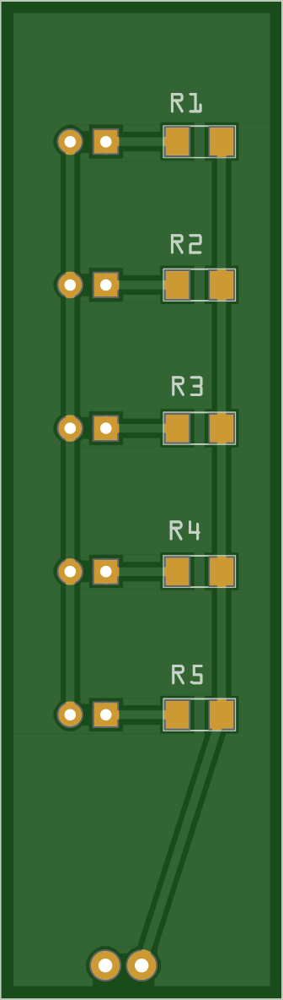
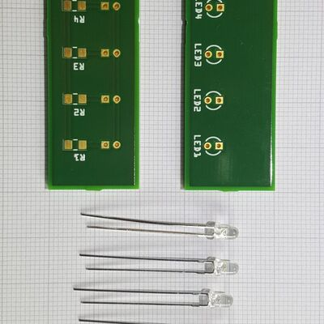
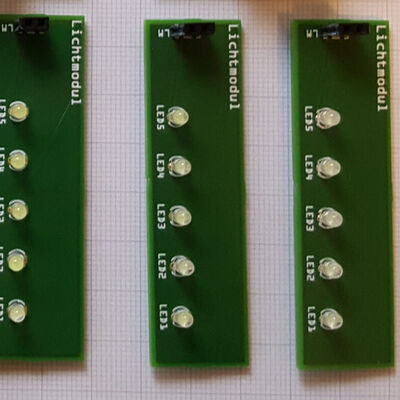
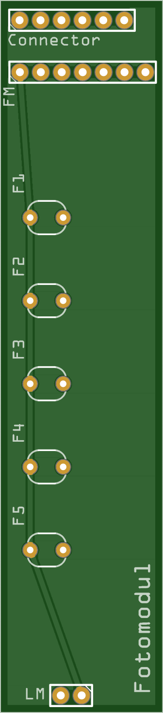
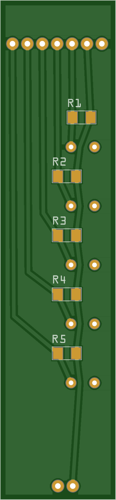
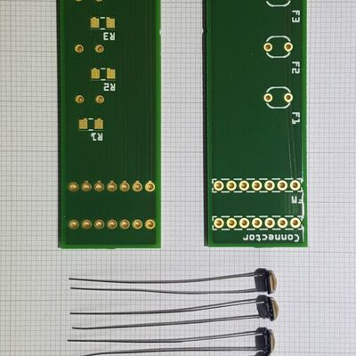
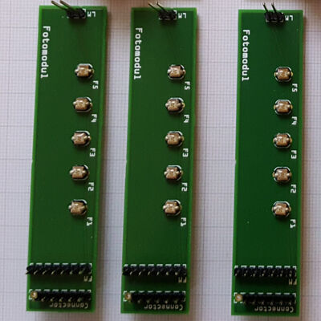

# Card Reader

The card reader (*Kartenmodul*, card module) is how the device knows which card
a player has inserted. It is an **optical** reader: it shines light through the
card and measures where the light gets through.

It is built from two stacked PCBs:

- the **Lichtmodul** (light module) — the illuminator, and
- the **Fotomodul** (photo module) — the sensor.

A card slides into the gap between them. Each card carries a pattern of clear
and opaque spots; the sensors below read that pattern as a 5-bit value. The
encoding itself is documented separately in the
[Optical Code System](../../reference/optical-codes.md) reference.

## Lichtmodul (light module)

The *Lichtmodul* is the light source. It carries **5× 3 mm LEDs**, each with its
own **330 Ω** series resistor to limit current. The five LEDs sit directly above
the five sensors on the *Fotomodul*, so each sensor is lit from above through
the card.

<figure markdown="span">
{ loading=lazy }
<figcaption>Lichtmodul PCB — top</figcaption>
</figure>
<figure markdown="span">
{ loading=lazy }
<figcaption>Lichtmodul PCB — bottom</figcaption>
</figure>

### Board markings

| Marking | What it is |
|---|---|
| `LED1`–`LED5` | The five 3 mm LEDs. |
| `R1`–`R5` | The 330 Ω series resistor belonging to the LED of the same number, mounted as SMD parts on the bottom side. |
| `LM` | The 2-pin connector (*Lichtmodul*) carrying power for the LEDs. It plugs into the matching `LM` header on the *Fotomodul* below. |
| `1` | Pin-1 marker, printed next to `LM`. |

### Parts & datasheets

The components populated on the *Lichtmodul*, with the datasheet for each part
archived in the repo where available.

| Component | Qty | Part / supplier | Datasheet |
|---|---|---|---|
| 3 mm white LED | 5 | Reichelt LED EL 3-11250KW (Bürklin 67 S 4470) | [PDF](https://github.com/d-rk/boomballon/blob/main/hardware/datasheets/204-15UTC-S400-X9-L_V2.pdf) |
| 330 Ω resistor (SMD 1206) | 5 | Reichelt SMD 1206, LED series resistor | [PDF](https://github.com/d-rk/boomballon/blob/main/hardware/datasheets/SMD_1206.pdf) |

### Gallery

Photos of the board, before and after assembly. Click any of them for a larger view.

[{ loading=lazy }](../../assets/img/gallery/lichtmodul-parts.jpg){ .glightbox data-gallery="lichtmodul" data-title="Lichtmodul — parts before assembly" }
[{ loading=lazy }](../../assets/img/gallery/lichtmodul-assembled.jpg){ .glightbox data-gallery="lichtmodul" data-title="Lichtmodul — assembled, LEDs populated" }

Fritzing source:
[`Kartenleser_Lichtmodul.fzz`](https://github.com/d-rk/boomballon/blob/main/hardware/card-reader/Kartenleser_Lichtmodul.fzz).

## Fotomodul (photo module)

The *Fotomodul* is the sensor board. It carries **5× photoresistors**
(light-dependent resistors, Reichelt A 905014), each forming a
**voltage divider** with a **330 Ω** resistor. Each divider's midpoint feeds one
of the Arduino's analog inputs, `A0`–`A4`. A lit sensor (light passing through a
clear spot on the card) and an unlit sensor (light blocked by an opaque spot)
produce clearly different analog voltages, which the firmware thresholds into
the 5 bits of the card code.

<figure markdown="span">
{ loading=lazy }
<figcaption>Fotomodul PCB — top</figcaption>
</figure>
<figure markdown="span">
{ loading=lazy }
<figcaption>Fotomodul PCB — bottom</figcaption>
</figure>

### Board markings

| Marking | What it is |
|---|---|
| `F1`–`F5` | The five photoresistors. Each one lines up under an LED on the *Lichtmodul*. |
| `R1`–`R5` | The 330 Ω divider resistor belonging to the sensor of the same number, mounted as SMD parts on the bottom side. |
| `LM` | The 2-pin header that feeds the *Lichtmodul* stacked above. |
| `FM` | The 7-pin header to the [control board](control-board.md) — 3.3 V, GND, and `A0`–`A4`. Pinout in the [table below](#fotomodul-connector-7-pin). |
| `Connector` | A 6-pin **pass-through for the display cable**, electrically no part of the card reader. The control board sits at the bottom of the case and the *Fotomodul* in the middle, so relaying the display cable through here keeps the display in the lid easy to unplug. |
| `1` | Pin-1 marker, printed next to `LM` and `FM`. |

### Parts & datasheets

The components populated on the *Fotomodul*, with the datasheet for each part
archived in the repo where available. Its 330 Ω divider resistors are the same
SMD 1206 part as on the *Lichtmodul* — see the
[note on the BOM page](../../reference/bill-of-materials.md).

| Component | Qty | Part / supplier | Datasheet |
|---|---|---|---|
| Photoresistor (LDR) | 5 | Reichelt A 905014 (Conrad 145475-62) | [PDF](https://github.com/d-rk/boomballon/blob/main/hardware/datasheets/A90xxxx%23PE.pdf) |
| 330 Ω resistor (SMD 1206) | 5 | Reichelt SMD 1206, divider resistor | [PDF](https://github.com/d-rk/boomballon/blob/main/hardware/datasheets/SMD_1206.pdf) |

### Gallery

Photos of the board, before and after assembly. Click any of them for a larger view.

[{ loading=lazy }](../../assets/img/gallery/fotomodul-parts.jpg){ .glightbox data-gallery="fotomodul" data-title="Fotomodul — parts before assembly" }
[{ loading=lazy }](../../assets/img/gallery/fotomodul-assembled.jpg){ .glightbox data-gallery="fotomodul" data-title="Fotomodul — assembled, photoresistors populated" }

Fritzing source:
[`Kartenleser_Fotomodul.fzz`](https://github.com/d-rk/boomballon/blob/main/hardware/card-reader/Kartenleser_Fotomodul.fzz).

### Fotomodul connector (7-pin)

The *Fotomodul* connects to the [control board](control-board.md) through a
7-pin header. Note the module runs at **3.3 V**, not 5 V, for a stable analog
reference:

| Pin | Signal | Notes |
|---|---|---|
| 1 | Vcc | **3.3 V** |
| 2 | GND | |
| 3 | A0 | card bit 0 |
| 4 | A1 | card bit 1 |
| 5 | A2 | card bit 2 |
| 6 | A3 | card bit 3 |
| 7 | A4 | card bit 4 |

The `A0`–`A4` lines land on the Arduino's analog inputs. For the complete signal
map across all modules, see the [wiring](../wiring.md).

## Calibration

Because photocell behaviour depends on the exact LEDs, ambient light, and card
material, the firmware ships with a bring-up harness that prints raw analog
values so you can pick thresholds. See
[`DETECTOR_CALIBRATION`](../firmware.md#build-switches) on the
firmware page.
