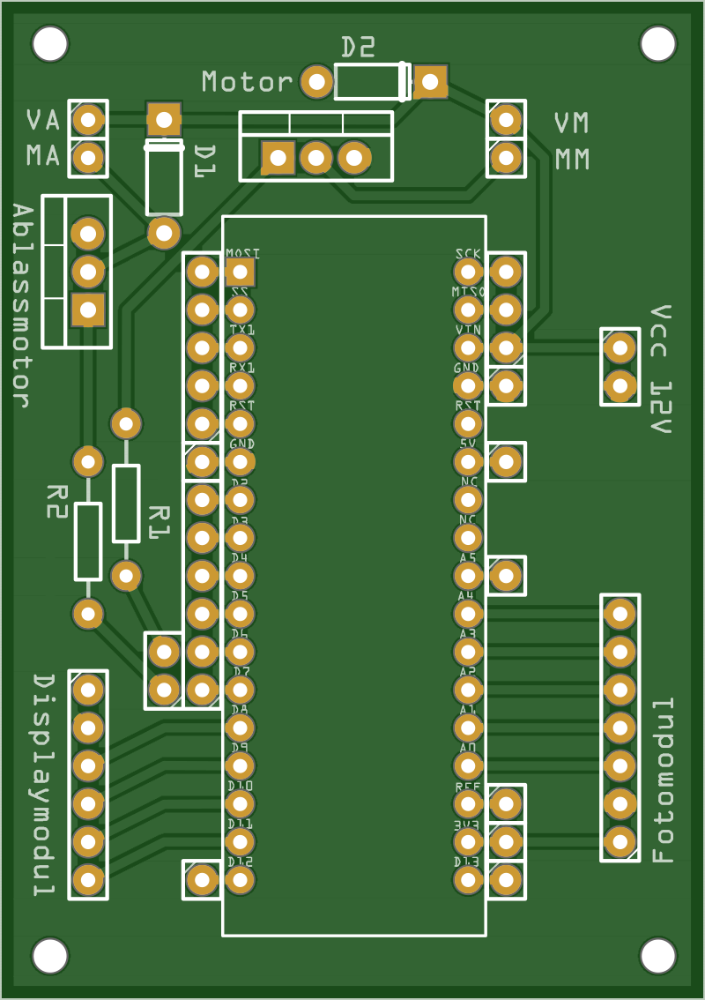
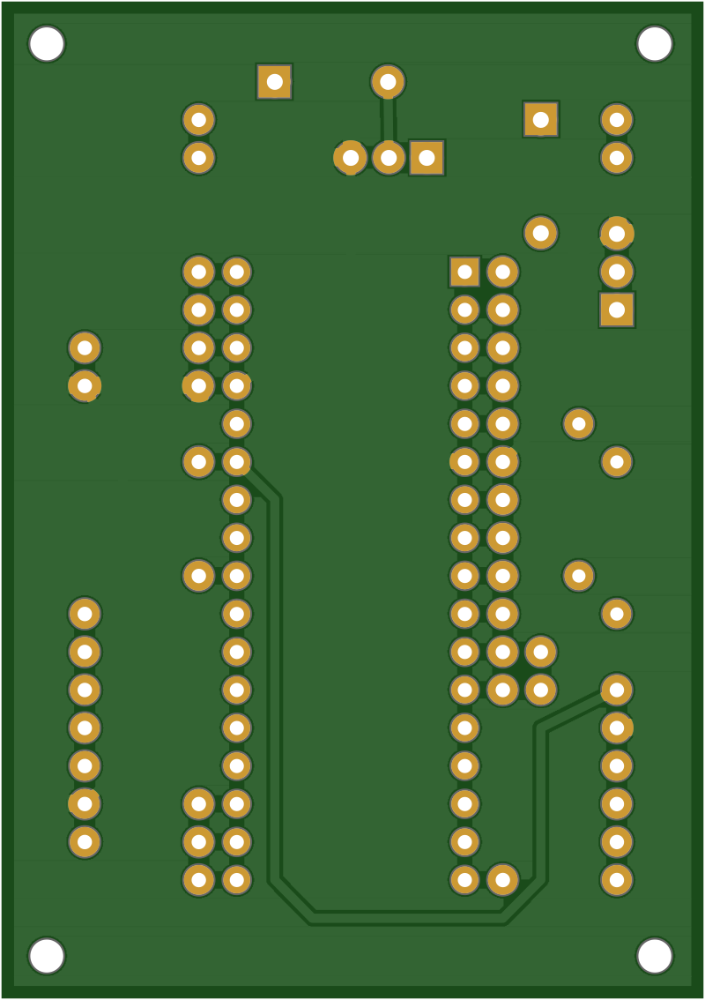
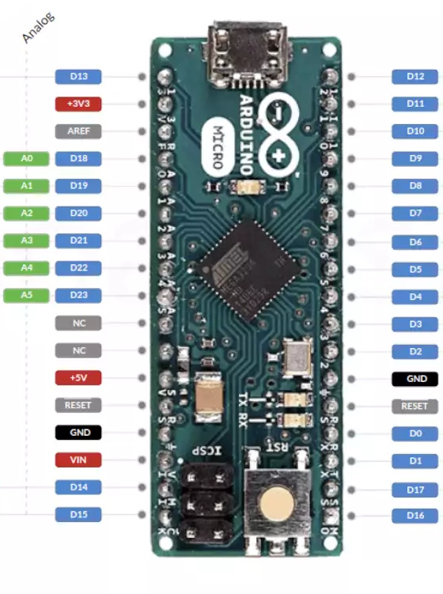
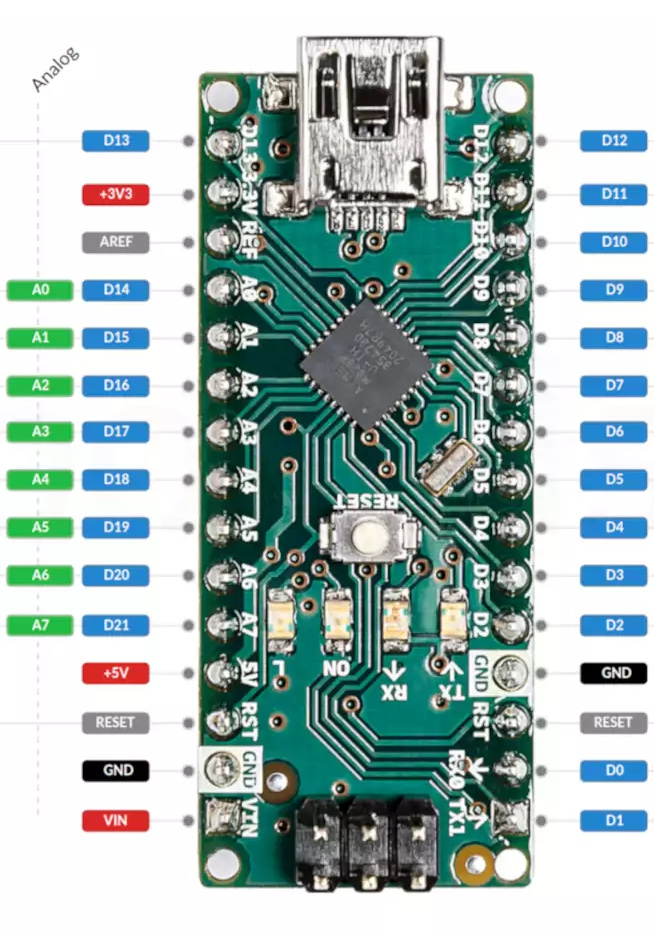
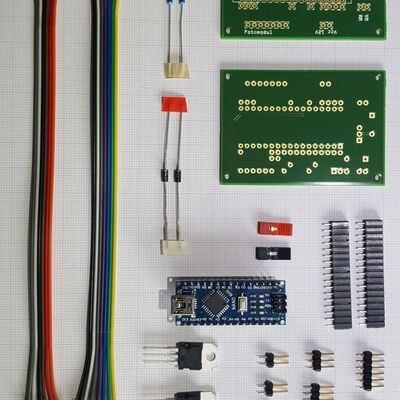
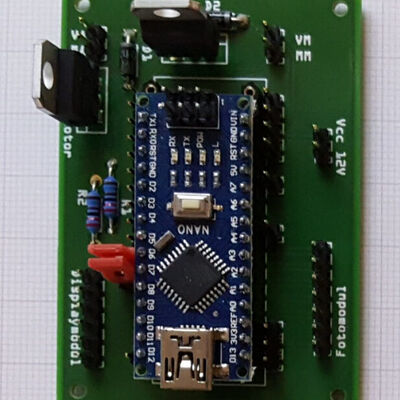
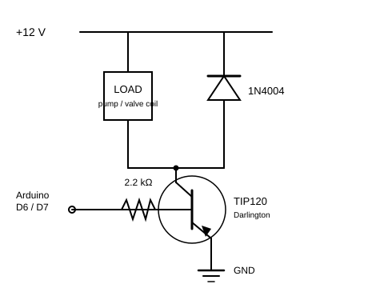

# Control Board

The control board (*Steuermodul*, control module) is the **hub** of the device.
The Arduino Nano sits on it, the 12 V power comes in here, and the other two
modules — the [card reader](card-reader.md) and the [display](display.md) — plug
into it. It also carries the power electronics that switch the two 12 V loads:
the inflate pump and the deflate valve.

<figure markdown="span">
{ loading=lazy }
<figcaption>Steuermodul PCB — top (Arduino and connectors)</figcaption>
</figure>
<figure markdown="span">
{ loading=lazy }
<figcaption>Steuermodul PCB — bottom</figcaption>
</figure>

### Board markings

| Marking | What it is |
|---|---|
| `Motor` | The 3-pin footprint for the **pump** channel's TIP120 (*Motor* = the inflate pump). |
| `Ablassmotor` | The same for the **valve** channel (*Ablassmotor* = release motor, the deflate solenoid). |
| `D1`, `D2` | The 1N4004 flyback diodes, one per channel, cathode toward +12 V. |
| `R1`, `R2` | The 2.2 kΩ base resistors, one per channel, between the MCU pin and the transistor base. |
| `MA`, `MM` | The **pump** output terminals, 12 V switched by `D6`. |
| `VA`, `VM` | The **valve** output terminals, 12 V switched by `D7`. |
| `Vcc 12V` | The 2-pin 12 V supply input. |
| `Fotomodul` | The 7-pin header to the [card reader](card-reader.md). |
| `Displaymodul` | The 6-pin header to the [display](display.md). |
| `1` | Pin-1 marker, printed next to each keyed header. |

The single unlabelled pads in rows beside the Arduino footprint are direct
break-outs of its pins, there so a signal can be tapped or jumpered by hand.

### Fitting the Nano in the Micro footprint

The footprint has **17 holes per row** — the Micro's pin count. The Nano has
15 per row, but the two layouts are compatible by design: the Micro's pinout
is the Nano's plus two extra pins per row at the far-from-USB end (its SPI
pins `D14`–`D17`), and its `NC` positions sit where the Nano has `A6`/`A7`.
Compare the two boards (both shown from the top, USB up):

<figure markdown="span">
{ loading=lazy }
<figcaption>Arduino Micro — its extra SPI pins (D14–D17) sit at the far-from-USB end; the two NC holes fall where the Nano instead has A6/A7</figcaption>
</figure>
<figure markdown="span">
{ loading=lazy }
<figcaption>Arduino Nano — all 30 pins land in the footprint, aligned to the USB end (A6/A7 fall in the Micro's NC holes)</figcaption>
</figure>

To place the Nano on the board:

- **USB connector toward the `Displaymodul`/`Fotomodul` headers** — the same
  direction the Micro's USB would face. The `D12` and `D13` holes are in that
  corner of the footprint.
- **Align flush with that USB end.** Every Nano pin then sits in the hole
  carrying its own name: `TX1`→`TX1` … `D12`→`D12` on one row, `VIN`→`VIN` …
  `D13`→`D13` on the other.

### Parts & datasheets

The components populated on the board, with the datasheet for each part archived
in the repo where available.

| Component | Qty | Part / supplier | Datasheet |
|---|---|---|---|
| Arduino Nano (ATmega328P) | 1 | Keywish Nano (footprint drawn for an Arduino Micro) | — |
| TIP120 Darlington transistor | 2 | STM (Reichelt) | [PDF](https://github.com/boomballoon/boomballoon/blob/main/hardware/datasheets/TIP120_TIP121_TIP122_TIP125_TIP126_TIP127%23STM.pdf) |
| 1N4004 flyback diode | 2 | Fairchild | [PDF](https://github.com/boomballoon/boomballoon/blob/main/hardware/datasheets/1N400x_FAI.pdf) |
| 2.2 kΩ resistor (metal film) | 2 | Reichelt METALL 2,20K, transistor base | [PDF](https://github.com/boomballoon/boomballoon/blob/main/hardware/datasheets/METALL%23YAG.pdf) |

The board is also the wiring hub for the power-entry parts and the two 12 V
loads it switches. These are **not** on the PCB — they mount in the enclosure
and land on the screw terminals — but are listed here since they are electrically
part of this module:

| Component | Qty | Part / supplier | Datasheet |
|---|---|---|---|
| DC socket (switched) | 1 | BKL 072342 | [PDF](https://github.com/boomballoon/boomballoon/blob/main/hardware/datasheets/072342.pdf) |
| Toggle switch (on/off) | 1 | MS-165 series | [PDF](https://github.com/boomballoon/boomballoon/blob/main/hardware/datasheets/MS-165_169.pdf) |
| Membrane pump (inflate) | 1 | AIRPO D2028B (12 V) | [PDF](https://github.com/boomballoon/boomballoon/blob/main/hardware/datasheets/AIRPO%20D2028B.pdf) |
| Solenoid valve (deflate) | 1 | CEME 5000EN1,5P | [PDF](https://github.com/boomballoon/boomballoon/blob/main/hardware/datasheets/Druckluft-Magnetventil%20CEME%205000EN1%2C5P.pdf) |

### Gallery

Photos of the board, before and after assembly. Click any of them for a larger view.

[{ loading=lazy }](../../assets/img/gallery/steuermodul-parts.jpg){ .glightbox data-gallery="steuermodul" data-title="Steuermodul — parts before assembly" }
[{ loading=lazy }](../../assets/img/gallery/steuermodul-assembled.jpg){ .glightbox data-gallery="steuermodul" data-title="Steuermodul — assembled, with the Nano fitted" }

## 12V Power switching

The Arduino cannot drive the 12 V pump or valve directly, so each load has a
**TIP120 Darlington transistor** acting as a low-side switch. There are two
identical channels:

- **Pump channel** — output terminals **MA/MM** (*Motor*), drives the AIRPO
  D2028B membrane pump (inflate). Controlled by MCU pin **D6**.
- **Valve channel** — output terminals **VA/VM** (*Ventil*, valve), drives the
  CEME 5000EN1,5P solenoid valve (deflate). Controlled by MCU pin **D7**.

Each channel is the textbook TIP120 low-side driver: the MCU pin drives the
base through a 2.2 kΩ resistor, the load sits between +12 V and the
collector, the emitter goes to ground, and a flyback diode bridges the load
(cathode to +12 V) to clamp the inductive kick when the transistor switches
off. One channel looks like this (`Dx` is `D6` for the pump, `D7` for the
valve):

<figure markdown="span">
{ loading=lazy }
<figcaption>One channel of the low-side switch — the pump and valve channels are identical, on D6/MA·MM and D7/VA·VM respectively</figcaption>
</figure>

The design basis is the **TIP120 tutorial**, archived here as
[`Motorsteuerung.pdf`](https://github.com/boomballoon/boomballoon/blob/main/hardware/control/Motorsteuerung.pdf).

## Connectors

Everything meets on this board:

| Connector | To module | Pins |
|---|---|---|
| Fotomodul header | [Card reader](card-reader.md) | 7-pin (3.3 V, `A0`–`A4`) |
| Displaymodul header | [Display](display.md) | 6-pin (5 V, `DS`/`STCP`/`SHCP`/buzzer) |
| Power input | 12 V / 3 A supply | via switched DC socket |
| Pump output (MA/MM) | AIRPO pump | 12 V, switched by D6 |
| Valve output (VA/VM) | CEME valve | 12 V, switched by D7 |

Fritzing source:
[`Steuermodul.fzz`](https://github.com/boomballoon/boomballoon/blob/main/hardware/control/Steuermodul.fzz).

For the complete, authoritative signal map — including which analog and digital
pins each connector carries — see the [wiring](../wiring.md).
