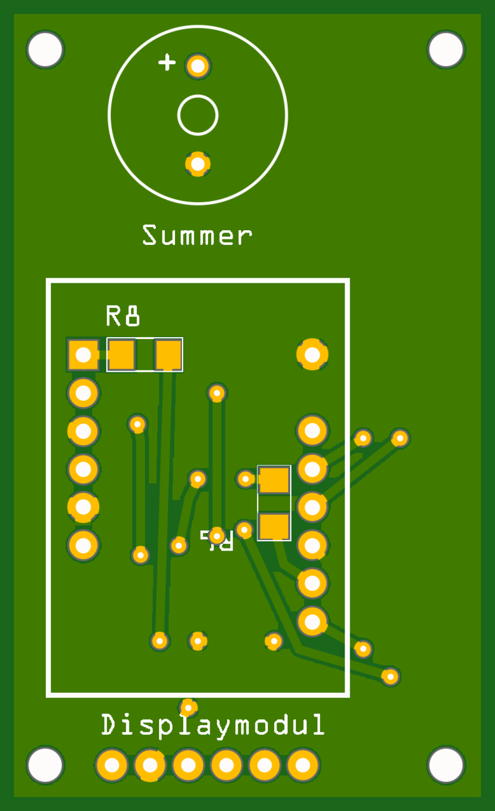
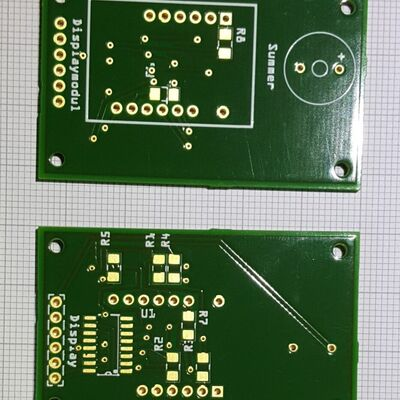
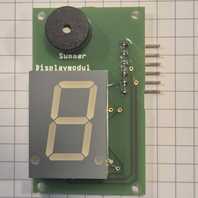
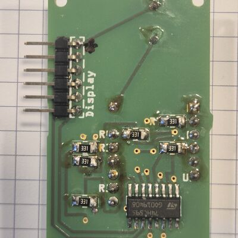
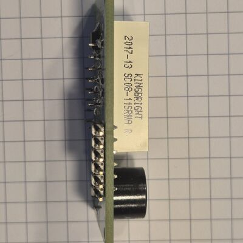
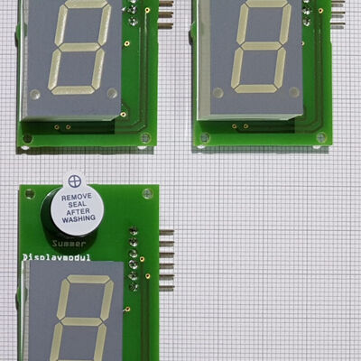

# Display

The display (*Displaymodul*) is the device's only visual output: a single
**20 mm 7-segment digit** that shows the current player number, countdowns, and
game state. It also carries the **piezo buzzer** for game sounds. Both are
driven from just four Arduino pins, because the segments go through a shift
register.

## Circuit

A single **74HC595** shift register (SMD) drives the display. The Arduino clocks
8 bits into the register serially; the register's eight outputs drive the seven
segments plus the decimal point, each through its own **330 Ω** current-limiting
resistor (**8× 330 Ω** total). This trades three fast MCU pins for eight segment
lines.

The 7-segment digit is **common cathode** (part SC08-11). The buzzer (EKULIT
AL-60P12) is driven directly from a dedicated MCU pin.

<figure markdown="span">
{ loading=lazy }
<figcaption>Displaymodul PCB — top</figcaption>
</figure>
<figure markdown="span">
{ loading=lazy }
<figcaption>Displaymodul PCB — bottom</figcaption>
</figure>

### Board markings

| Marking | What it is |
|---|---|
| `Summer` | The piezo buzzer (*Summer* is German for buzzer). The `+` marks its positive pin. |
| `U1` | The 74HC595 shift register, an SOIC-16 SMD part on the bottom side. The dot and the notch in its outline mark pin 1. |
| `R1`–`R8` | The eight 330 Ω series resistors, one per shift-register output: seven segments plus the decimal point. SMD, bottom side. |
| `Display` | The 6-pin connector to the [control board](control-board.md). Pinout in the [table below](#connector-6-pin). |

### Parts & datasheets

The components populated on the board, with the datasheet for each part archived
in the repo where available. The eight segment resistors are the same 330 Ω SMD
1206 part used elsewhere — see the [note on the BOM page](../../reference/bill-of-materials.md).

| Component | Qty | Part / supplier | Datasheet |
|---|---|---|---|
| 7-segment 20 mm digit (common cathode) | 1 | SC08-11 | [PDF](https://github.com/d-rk/boomballon/blob/main/hardware/datasheets/SC08-11SRWA%28V6%29.pdf) |
| 74HC595 shift register (SOIC-16, SMD) | 1 | SMD HC 595 | [PDF](https://github.com/d-rk/boomballon/blob/main/hardware/datasheets/smd_hc_595.pdf) |
| 330 Ω resistor (SMD 1206) | 8 | Reichelt SMD 1206, segment resistors | [PDF](https://github.com/d-rk/boomballon/blob/main/hardware/datasheets/SMD_1206.pdf) |
| Piezo buzzer | 1 | EKULIT AL-60P12 | [PDF](https://github.com/d-rk/boomballon/blob/main/hardware/datasheets/155120AL-60P12.pdf) |

### Gallery

Photos of the board, before and after assembly. Click any of them for a larger view.

[{ loading=lazy }](../../assets/img/gallery/displaymodul-boards.jpg){ .glightbox data-gallery="displaymodul" data-title="Displaymodul — bare PCBs, both sides" }
[{ loading=lazy }](../../assets/img/gallery/displaymodul-top.jpg){ .glightbox data-gallery="displaymodul" data-title="Displaymodul — top side, assembled" }
[{ loading=lazy }](../../assets/img/gallery/displaymodul-bottom.jpg){ .glightbox data-gallery="displaymodul" data-title="Displaymodul — bottom side, assembled" }
[{ loading=lazy }](../../assets/img/gallery/displaymodul-edge.jpg){ .glightbox data-gallery="displaymodul" data-title="Displaymodul — edge on, showing the header and the display's part label" }
[{ loading=lazy }](../../assets/img/gallery/displaymodul-assembled.jpg){ .glightbox data-gallery="displaymodul" data-title="Displaymodul — assembled boards" }

Fritzing source:
[`Displaymodul.fzz`](https://github.com/d-rk/boomballon/blob/main/hardware/display/Displaymodul.fzz).

## Connector (6-pin)

The module connects to the [control board](control-board.md) through a 6-pin
header. The three shift-register control lines and the buzzer map to Arduino
digital pins as shown. The module runs at **5 V**:

| Pin | Signal | 74HC595 role | MCU pin |
|---|---|---|---|
| 1 | Vcc | +5 V | — |
| 2 | GND | | — |
| 3 | DS | serial **data** in | **D8** |
| 4 | STCP | storage-register clock (**latch**) | **D9** |
| 5 | SHCP | shift-register **clock** | **D10** |
| 6 | Buzzer | piezo buzzer drive | **D11** |

To update the digit, the firmware shifts 8 bits out on `DS`/`SHCP` (`D8`/`D10`),
then pulses `STCP` (`D9`) to latch them to the outputs. For the complete signal
map across all modules, see the [wiring](../wiring.md).
