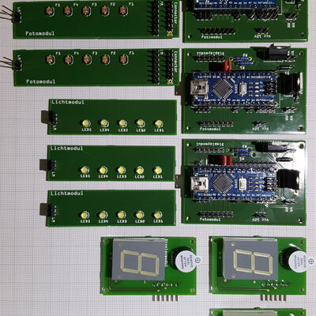

# Modules

This chapter describes the electronics that make the game work. They are
split into three cooperating modules, each holding a distinct part of the
circuit on its own dedicated PCB. This keeps soldering and wiring simple —
each small board can be populated and tested on its own before everything is
connected. Each module has its own page describing it in detail.

[{ loading=lazy }](../../assets/img/gallery/modules_all.jpg){ .glightbox data-title="The three electronic modules — card reader, control board, and display" }

- [Card reader](card-reader.md) — *Kartenmodul* (card module)
- [Display](display.md) — *Displaymodul*
- [Control board](control-board.md) — *Steuermodul* (control module)
