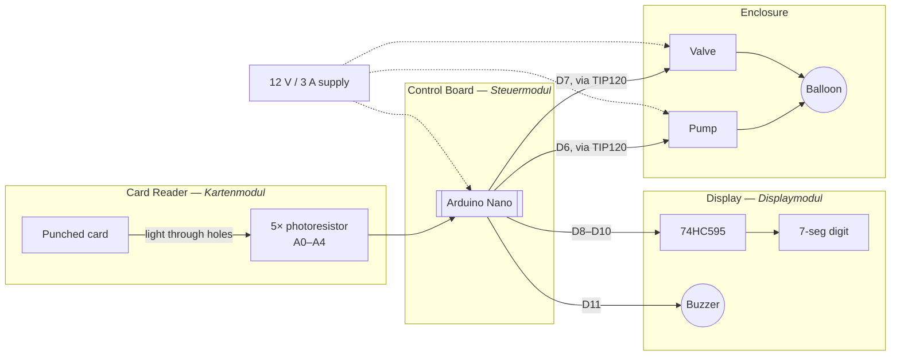

# System Overview

At the centre of the device is an **Arduino Nano** (ATmega328P). Three
electronic modules plug into it, and everything lives inside a 3D-printed
housing:

1. The **card reader** optically senses which card is inserted. Five 3 mm LEDs
   (the *Lichtmodul*, light module) shine through the card onto five
   photoresistors (the *Fotomodul*, photo module); the pattern of light/dark
   spots encodes a 5-bit card value on analog inputs `A0`–`A4`.
2. The **control board** (*Steuermodul*) is the physical hub. The Arduino sits
   on it, and two TIP120 Darlington channels switch the 12 V loads: a membrane
   pump that **inflates** the balloon and a solenoid valve that **deflates** it.
   The card-reader and display connectors also land here.
3. The **display** (*Displaymodul*) is a single 20 mm 7-segment digit driven by
   a 74HC595 shift register, plus a piezo buzzer for game sounds.
4. The **enclosure** holds the balloon, the display window, the card slot, and
   the pump/valve mounts.

Power comes from a single **12 V / 3 A** supply. The 12 V rail feeds the pump
and valve; the Arduino derives the 5 V logic rail; the card-reader's *Fotomodul*
runs at **3.3 V** for a stable analog reference. The exact pin assignments are
on the [wiring & pin map](wiring-pinmap.md) page — the authoritative source for
all connections.

The diagram below groups the same connections by physical module — card
reader, control board, display, and enclosure — so it lines up directly with
the four modules above. Solid arrows are the signal path (card → sense →
Arduino Nano → outputs); dashed arrows are the shared 12 V power feed. Exact
pin numbers are on the [wiring & pin map](wiring-pinmap.md).

For how the software drives all this during play, see
[How It Works](../how-it-works.md); for the card encoding scheme, see the
[Optical Code System](../reference/optical-codes.md); for the full parts
list, see the [Bill of Materials](../reference/bill-of-materials.md).
