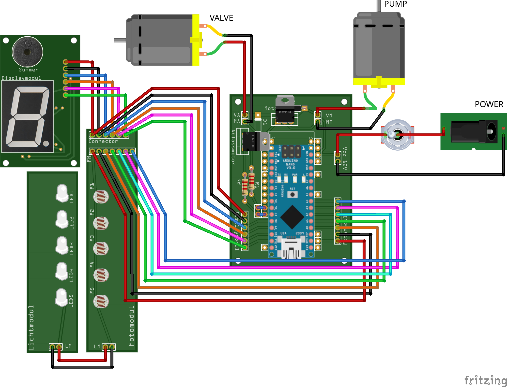

# Wiring

This page describes how the Arduino Nano on the control board connects to
everything else.

{ loading=lazy }

## Master pin map

| Function | MCU pin | Dir | Connects to |
|---|---|---|---|
| Card reader bit 0 | A0 | in | Fotomodul 7-pin (pin 3) |
| Card reader bit 1 | A1 | in | Fotomodul 7-pin (pin 4) |
| Card reader bit 2 | A2 | in | Fotomodul 7-pin (pin 5) |
| Card reader bit 3 | A3 | in | Fotomodul 7-pin (pin 6) |
| Card reader bit 4 | A4 | in | Fotomodul 7-pin (pin 7) |
| Pump (inflate) | D6 | out | Steuermodul **MA/MM** → TIP120 → AIRPO pump |
| Valve (deflate) | D7 | out | Steuermodul **VA/VM** → TIP120 → CEME solenoid |
| Display data (DS) | D8 | out | Displaymodul pin 3 → 74HC595 serial data |
| Display latch (STCP) | D9 | out | Displaymodul pin 4 → 74HC595 storage clock |
| Display clock (SHCP) | D10 | out | Displaymodul pin 5 → 74HC595 shift clock |
| Buzzer | D11 | out | Displaymodul pin 6 → piezo buzzer |
| RNG seed | A5 | — | **must stay unconnected (floating)** |

!!! warning "Leave A5 floating"
    `A5` is deliberately **not connected**. The firmware reads its floating,
    noisy analog value to seed the random-number generator. Wiring it to
    anything would make the seed deterministic and hurt game randomness.

## Power

A single **12 V / 3 A** supply powers the whole device, entering through a
switched DC socket:

- **12 V rail** → the pump and the valve (switched by the two TIP120 channels on
  the [control board](modules/control-board.md)).
- **5 V logic rail** → derived on the Arduino; powers the Arduino itself and the
  [display module](modules/display.md) (74HC595 + buzzer).
- **3.3 V** → the [card reader's *Fotomodul*](modules/card-reader.md), for a
  stable analog reference on `A0`–`A4`.

## Where the connectors live

All three modules meet on the [control board](modules/control-board.md):

- **Fotomodul 7-pin** — 3.3 V, GND, and `A0`–`A4`
  (see the [card reader](modules/card-reader.md#fotomodul-connector-7-pin)).
- **Displaymodul 6-pin** — 5 V, GND, `DS`/`STCP`/`SHCP`, and buzzer
  (see the [display](modules/display.md#connector-6-pin)).
- **12 V input** and the pump/valve output terminals (`MA/MM`, `VA/VM`).
