# The Card Deck

This page is the **authoritative catalog** of the Boom Balloon deck. Every card's German name, English gloss, optical code, effect, and deck count is listed here; printed face values are shown in the card captions above.

## The cards

The full deck, card by card. Printed face values are shown in the captions; see [the catalog](#the-catalog) below for each card's optical code and effect.

### Effect cards

<figure markdown="span">
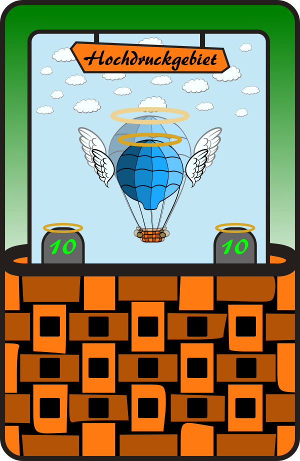{ loading=lazy }
<figcaption>Hochdruckgebiet 10</figcaption>
</figure>
<figure markdown="span">
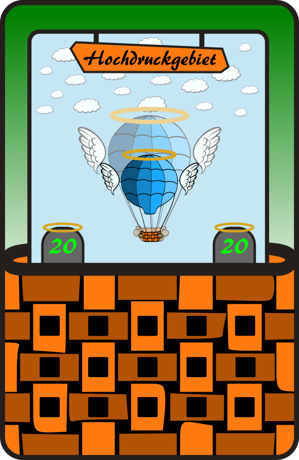{ loading=lazy }
<figcaption>Hochdruckgebiet 20</figcaption>
</figure>
<figure markdown="span">
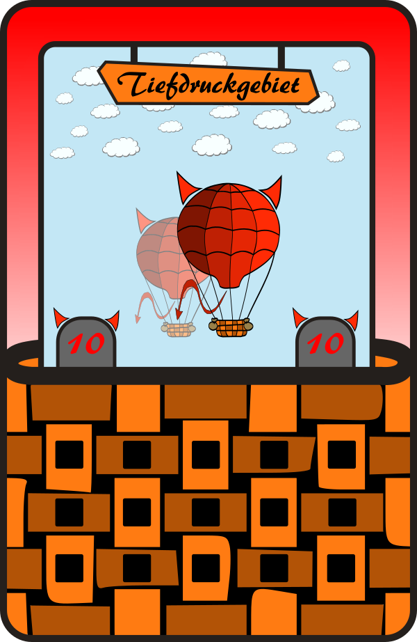{ loading=lazy }
<figcaption>Tiefdruckgebiet 10</figcaption>
</figure>
<figure markdown="span">
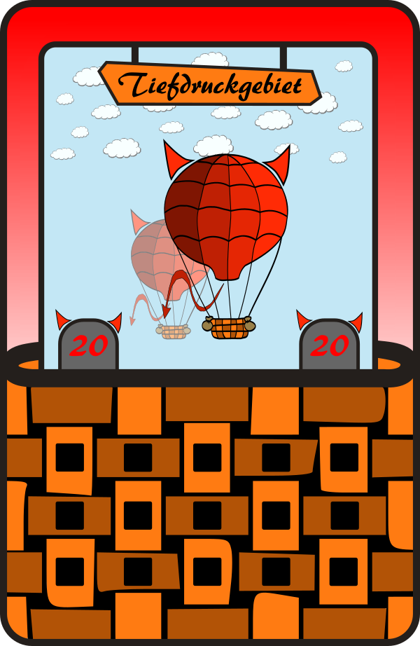{ loading=lazy }
<figcaption>Tiefdruckgebiet 20</figcaption>
</figure>
<figure markdown="span">
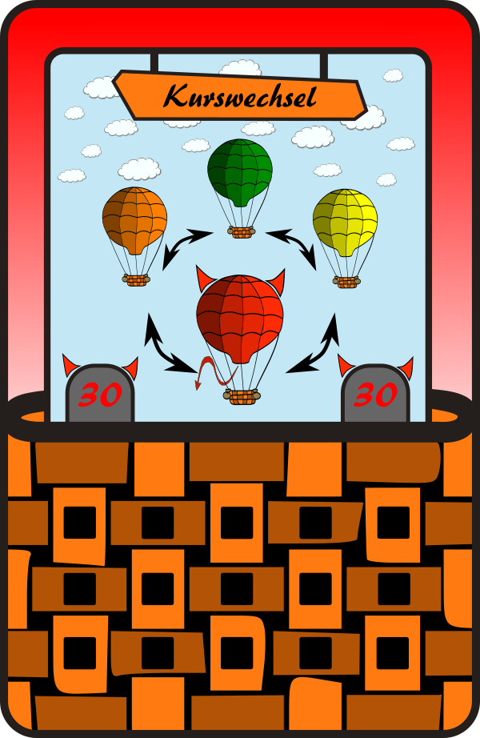{ loading=lazy }
<figcaption>Kurswechsel 30 ↓</figcaption>
</figure>
<figure markdown="span">
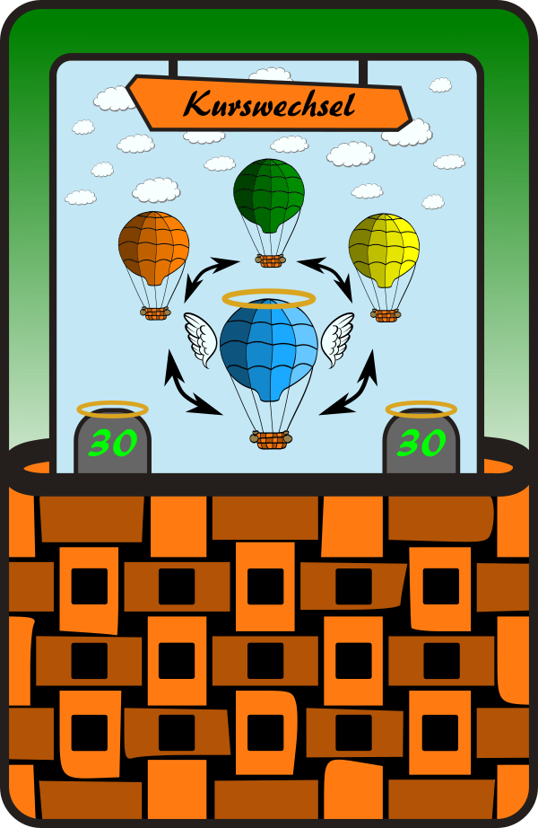{ loading=lazy }
<figcaption>Kurswechsel 30 ↑</figcaption>
</figure>
<figure markdown="span">
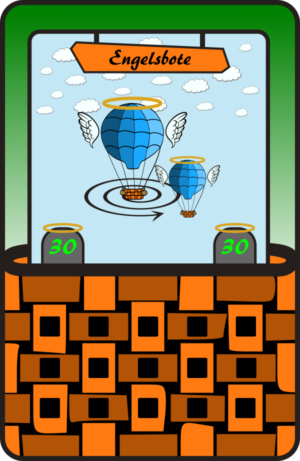{ loading=lazy }
<figcaption>Engelsbote 30</figcaption>
</figure>
<figure markdown="span">
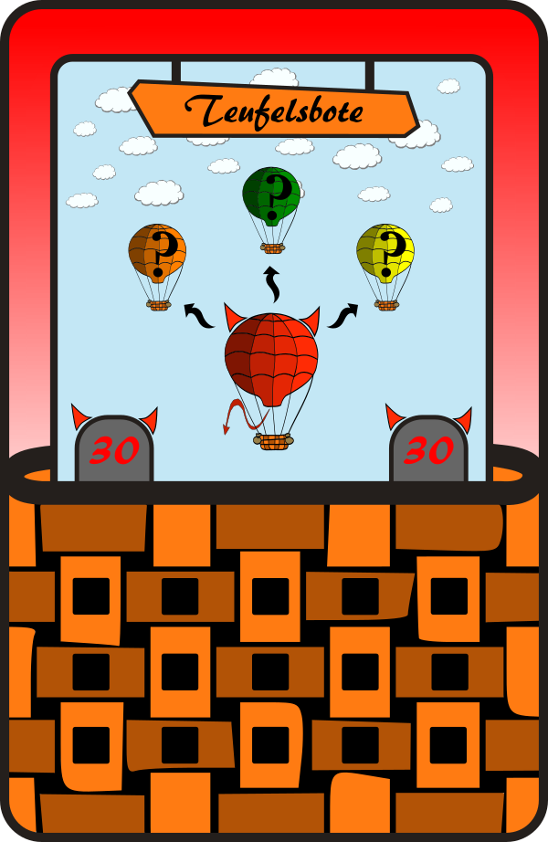{ loading=lazy }
<figcaption>Teufelsbote 30</figcaption>
</figure>
<figure markdown="span">
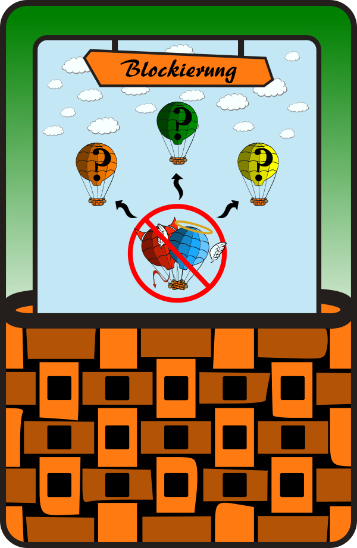{ loading=lazy }
<figcaption>Blockierung</figcaption>
</figure>
<figure markdown="span">
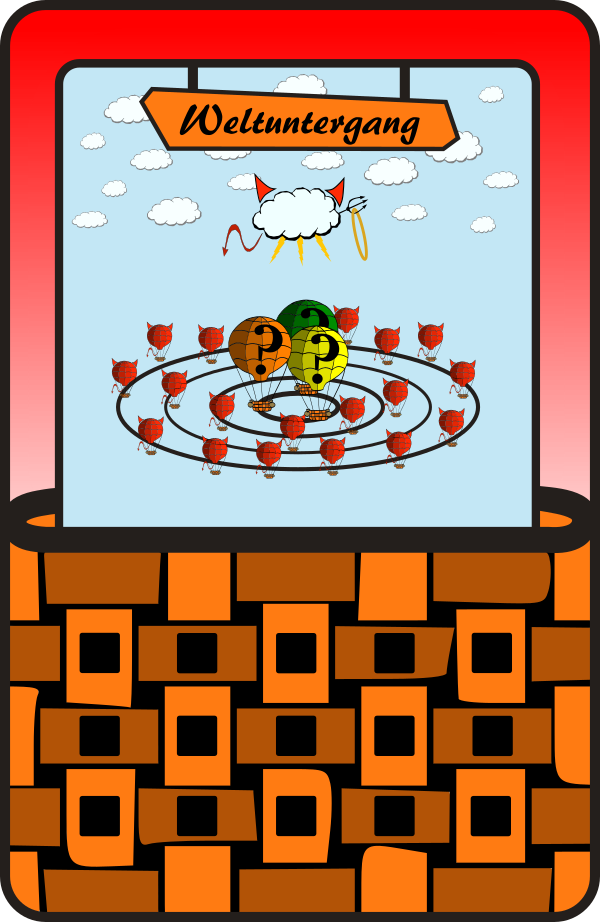{ loading=lazy }
<figcaption>Weltuntergang</figcaption>
</figure>
<figure markdown="span">
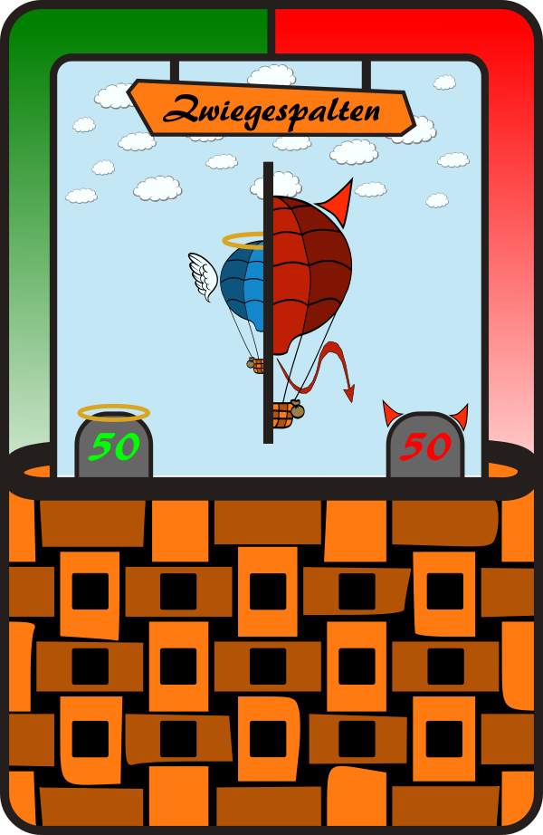{ loading=lazy }
<figcaption>Zwiegespalten 50</figcaption>
</figure>
<figure markdown="span">
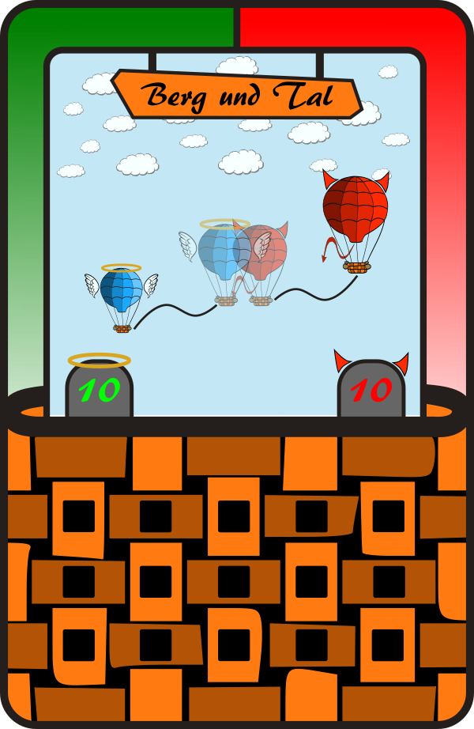{ loading=lazy }
<figcaption>Berg und Tal 10</figcaption>
</figure>
<figure markdown="span">
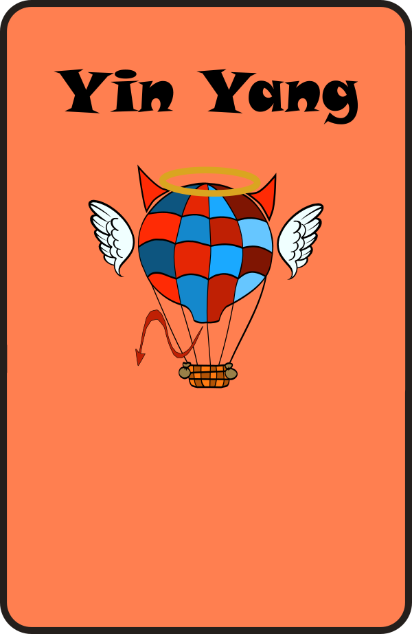{ loading=lazy }
<figcaption>Yin Yang</figcaption>
</figure>

### Player cards

<figure markdown="span">
{ loading=lazy }
<figcaption>1 Spieler</figcaption>
</figure>
<figure markdown="span">
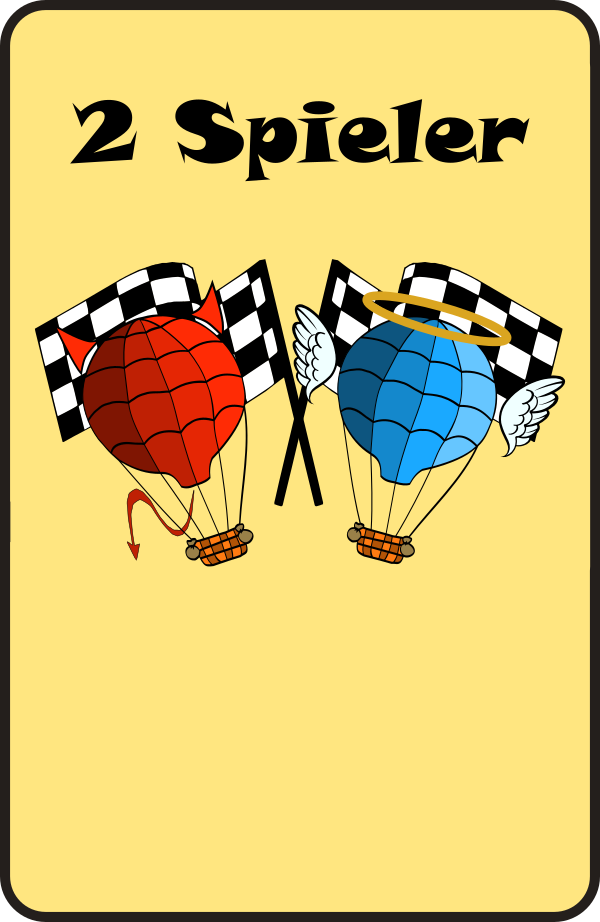{ loading=lazy }
<figcaption>2 Spieler</figcaption>
</figure>
<figure markdown="span">
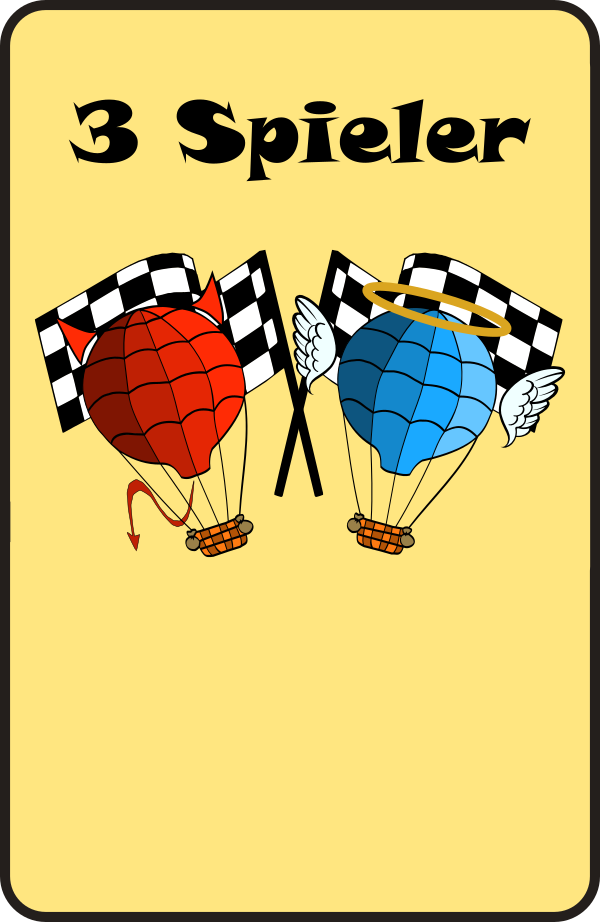{ loading=lazy }
<figcaption>3 Spieler</figcaption>
</figure>
<figure markdown="span">
{ loading=lazy }
<figcaption>4 Spieler</figcaption>
</figure>
<figure markdown="span">
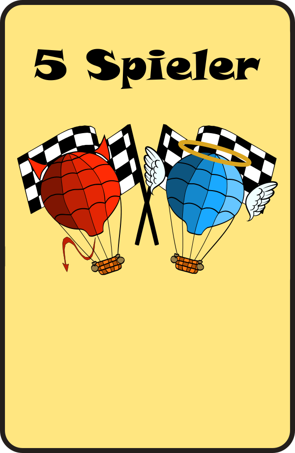{ loading=lazy }
<figcaption>5 Spieler</figcaption>
</figure>

### Others

<figure markdown="span">
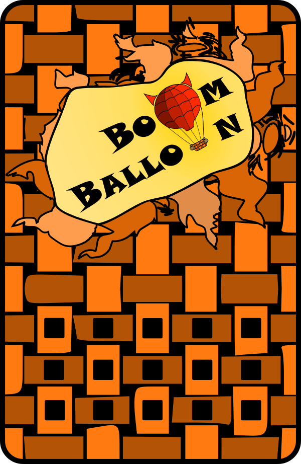{ loading=lazy }
<figcaption>card back side</figcaption>
</figure>
<figure markdown="span">
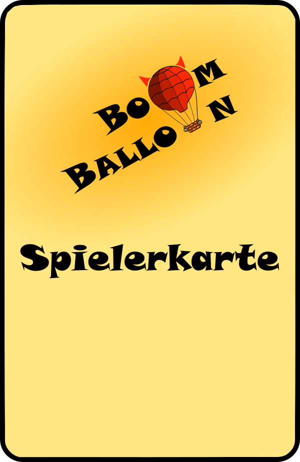{ loading=lazy }
<figcaption>player card back side</figcaption>
</figure>
<figure markdown="span">
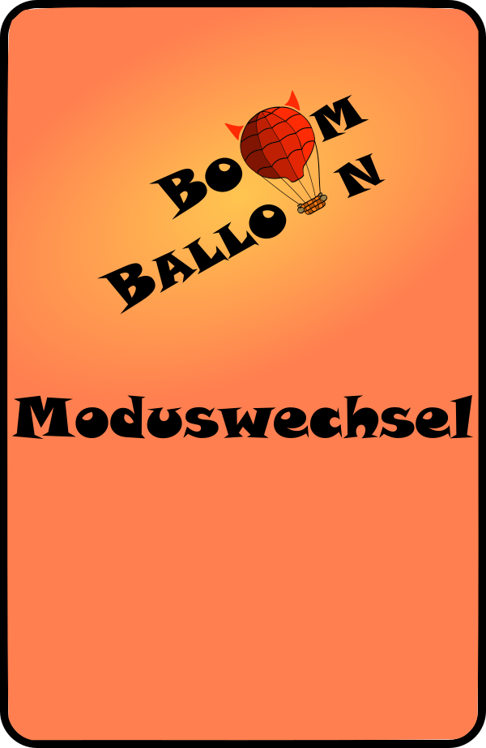{ loading=lazy }
<figcaption>Moduswechsel</figcaption>
</figure>

## What a card is

Every card is a printed rectangle with a machine-readable hole pattern:

- **Physical size:** 90 × 60 × 1 mm.
- **Holes:** 3 mm in diameter, spaced 10 mm apart.
- **Code:** 5 hole positions, so each card carries a **5-bit optical code** (a hole present or absent at each position). The card reader scans this pattern as the card slides in. See the [Optical Code System](../reference/optical-codes.md) reference for the bit layout and mirror-handling rules.

## The catalog

| German name | English gloss | Code | Effect | Count |
|---|---|---|---|---|
| Hochdruckgebiet 10 | High-pressure zone (deflate) | 1 | Deflates the balloon by 10 units. | 6 |
| Hochdruckgebiet 20 | High-pressure zone | 2 | Deflates the balloon by 20 units. | 6 |
| Kurswechsel 30 ↓ | Change of course (down) | 3 | Deflates the balloon by 30 units and reverses the direction of play. | 4 |
| Engelsbote 30 | Angel's messenger | 4 | Deflates the balloon by 30 units, but only at the start of the next round. | 3 |
| Blockierung | Blocking / miss round | 5 | The targeted player has a coin-flip chance of missing their turn. | 2 |
| Tiefdruckgebiet 10 | Low-pressure zone (inflate) | 6 | Inflates the balloon by 10 units. | 6 |
| Tiefdruckgebiet 20 | Low-pressure zone | 7 | Inflates the balloon by 20 units. | 6 |
| Kurswechsel 30 ↑ | Change of course (up) | 9 | Inflates the balloon by 30 units and reverses the direction of play. | 4 |
| Teufelsbote 30 | Devil's messenger | 10 | A coin-flip chance of a sudden, dangerous inflate of 30 units. | 3 |
| Weltuntergang | Apocalypse | 11 | Repeatedly inflates the balloon toward its bursting point. | 2 |
| Zwiegespalten 50 | Torn / fifty-fifty | 13 | A coin flip decides whether the balloon inflates or deflates by 50 units. | 3 |
| Berg und Tal 10 | Up hill and down | 14 | Repeatedly inflates and deflates the balloon by 10 units. | 3 |
| Yin Yang | Yin & Yang | 27 | Inflates the balloon almost all the way to its bursting point. | 1 |
| 1–5 Spieler | Player 1–5 | 15/17/19/21/23 | Picks a player as a target, or sets the game size at startup. | 1 each |

## Deck total and the player cards

The full deck is **about 54 cards**: **49 effect cards** (the play cards, or *Spielkarten*) plus **5 player cards** (*Spielerkarten*), for **54** in total.

The player cards, **`1 Spieler`…`5 Spieler`**, do two jobs:

- During play they act as **target cards** — you insert one to choose which player a target-based card (Teufelsbote, Blockierung, Weltuntergang) affects.
- The **`2 Spieler`…`5 Spieler`** cards additionally **choose the game size** when inserted at startup (see [Rules → Setting up a game](rules.md#setting-up-a-game)).

The **Yin Yang** card is a rare single wildcard that pushes the modelled volume all the way to the limit.

!!! info "The Moduswechsel card"
    The **Moduswechsel** ("mode change") card shown under [Others](#others) is not wired to any optical code and has no effect in the shipped firmware — inserting it does nothing. It's the leftover artwork for an unbuilt **game-mode selector**, originally meant to let players cycle through four play modes before starting a round. That feature was specced but never implemented; see [Firmware Architecture → The unbuilt mode system](../reference/firmware-architecture.md#the-unbuilt-mode-system) for the full history, including how code 27 ended up going to the **Yin Yang** card's one-shot `PushToLimitCard` instead.
