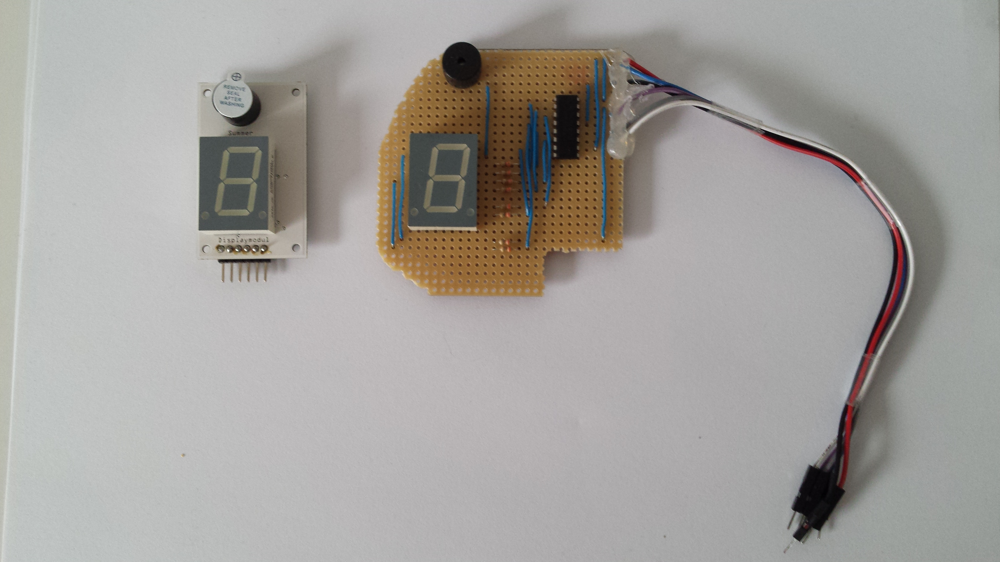
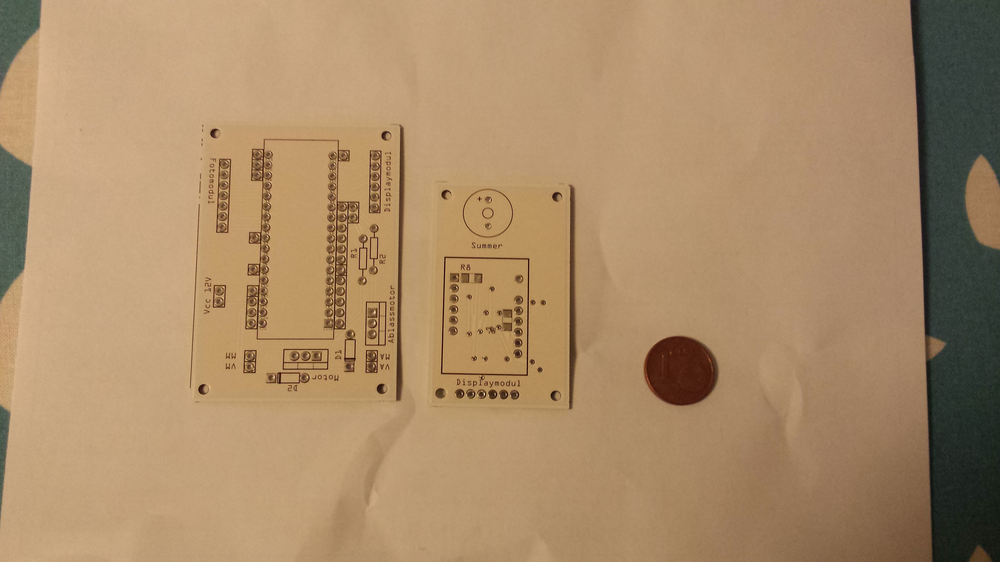

# The Story

BoomBalloon began the way a lot of good ideas do: two friends, a silly premise, and the stubbornness to actually build it. Between roughly **2016 and 2018**, Dirk and Christian turned "what if a machine inflated a real balloon until it burst?" into a working electronic party game — designed, coded, printed, and prototyped in multiple units. It was a hobby project with a serious, pre-commercial ambition behind it: the goal was a boxed product you could put on a shelf.

## From breadboard to game

{ loading=lazy }

The concept is deceptively simple — a balloon, a pump, and the nerve to keep playing — but making it read cards on its own was where the engineering lived. Instead of buttons, BoomBalloon uses a deck of cards punched with an optical code, and a custom reader that scans each card as it slides in. That decision shaped everything that followed: the card artwork, the reader mechanism, the firmware, and eventually the enclosure all had to serve the card.

## Timeline

**2016 — First prototypes and the card reader.**
The earliest builds proved the core loop on a breadboard: a card goes in, the machine inflates or deflates, a display tracks the game. In parallel came the first CAD work for the optical card reader — the brick-styled tray that gives the game its look and does the actual scanning.

**2017 — Art, bill of materials, and a real deck.**
With the mechanics working, the project turned to polish. The card artwork was finalized, the bill of materials was locked down, and a full deck of cards was printed and boxed. This was the year BoomBalloon started to look and feel like a product rather than a bench experiment.

**2018 — Toward an enclosure.**
The final push was housing the electronics. Enclosure options were quoted and a sticker was produced for a metal-box version of the game. This is also where the project met its practical ceiling: a nice enclosure at hobby quantities is expensive, and the numbers did not add up for a small run.

## The controller: from Micro to Nano

Under the hood, BoomBalloon runs on an **Arduino** microcontroller. The design was migrated from an earlier board built around the **Arduino Micro** — the "prototype 2" generation — to the **Arduino Nano** (ATmega328P) used in the current prototype. The move brought the electronics onto the compact, low-cost controller that the finished firmware targets today.

{ loading=lazy }

## Where it landed

BoomBalloon is a **functional, multi-unit prototype**. The firmware is complete — cards are decoded, the balloon-volume model runs, and the game plays end to end with sound and a live display. What never happened was the leap to a retail product: the **housing was cost-blocked**, and the **retail boxes were never ordered**.

Across all the prototype work — boards, pump, valve, reader, printed cards, and enclosure quotes — the total spend came to roughly **€577**. For a project that produced a genuinely playable machine and a printed deck, that is a modest price for the lesson every hardware hobbyist eventually learns: the electronics are the easy part; it is the box around them that decides whether a prototype becomes a product.

This site is the archive of that work — a place to see how BoomBalloon plays, how it was built, and how the machine reads its cards. Start with [How It Works](how-it-works.md), or browse [the card deck](gameplay/card-deck.md) and the [build guide](build-guide/overview-bom.md).
